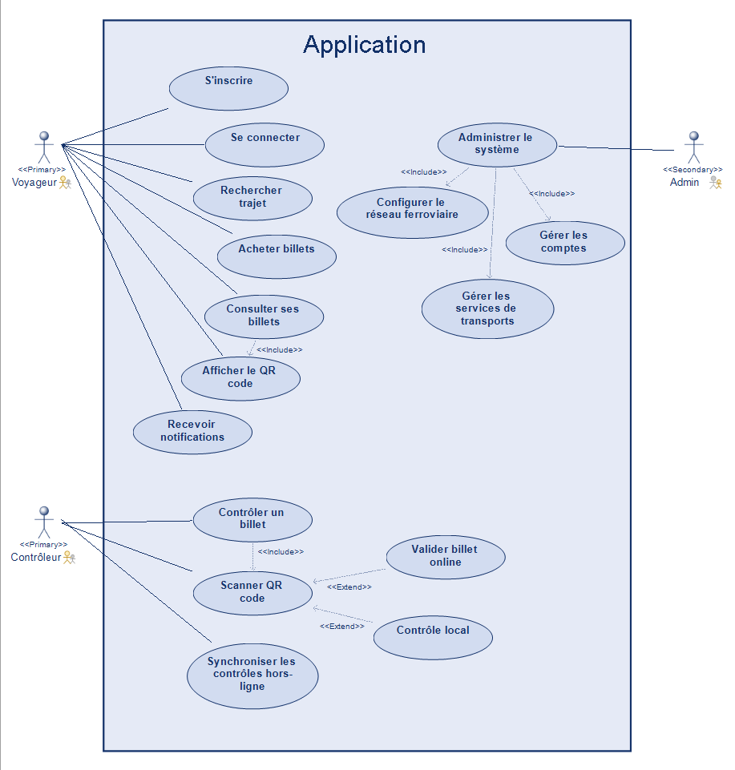
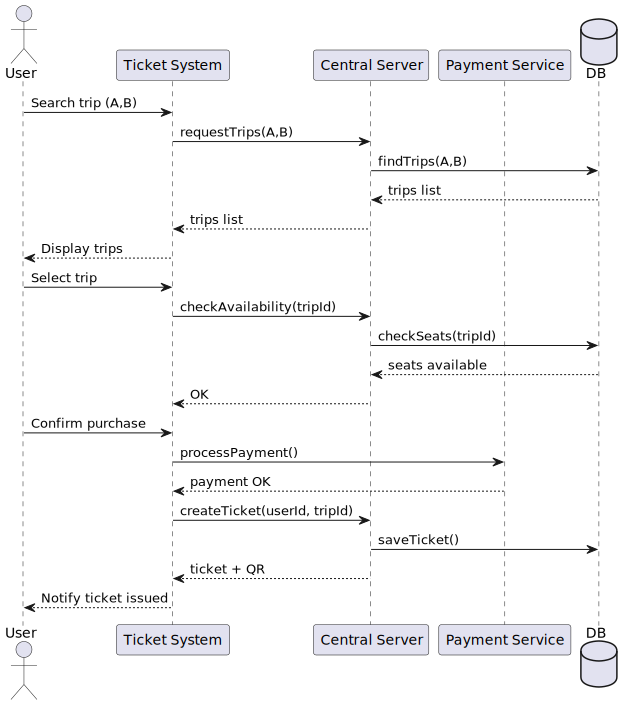
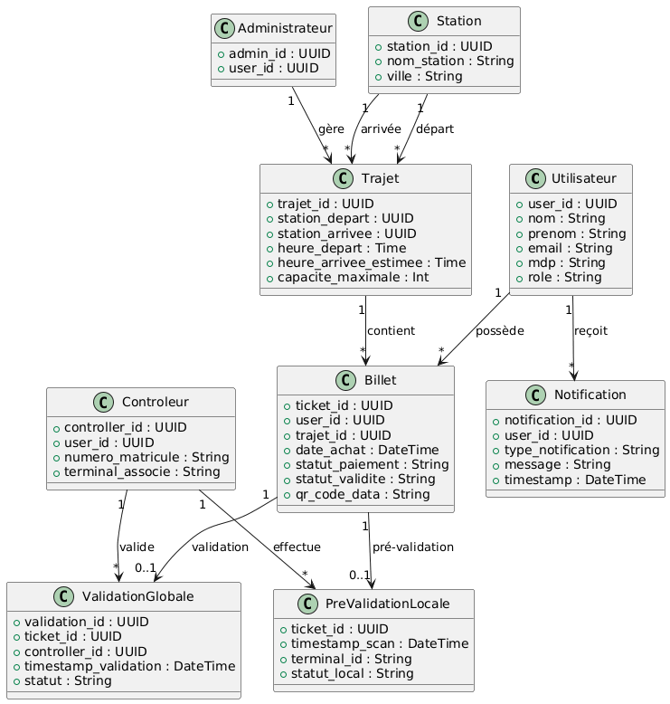

# 💡 Un système de gestion de la billetterie d'un réseau ferroviaire 

**Auteurs (trices) :** Illia VLASENKO - Van Trang DANG - William PLEYERS

## Contenus
### 1. Acteurs et cas d'utilisation
- [1.1. Description détaillée des acteurs](#11-description-détaillée-des-acteurs)
  - [1.1.1. Voyageur (Client)](#111-voyageur-client)
  - [1.1.2. Contrôleur (Unité de contrôle)](#112-contrôleur-unité-de-contrôle)
  - [1.1.3. Administrateur système](#113-administrateur-système)
  - [1.1.4. Serveur central (Système externe logique)](#114-serveur-central-système-externe-logique)
  - [1.1.5. Système de paiement simulé](#115-système-de-paiement-simulé)
- [1.2. Diagramme de cas d’utilisation global](#12-diagramme-de-cas-dutilisation-global)

### 2. Scénarios d’utilisation

- [2.1. Scénario 1 – Achat d’un billet](#21-scénario-1--achat-dun-billet)
  - [2.1.1. Objectif du scénario](#211-objectif-du-scénario)
  - [2.1.2. Acteurs impliqués](#212-acteurs-impliqués)
  - [2.1.3. Déroulement nominal détaillé](#213-déroulement-nominal-détaillé)
  - [2.1.4. Analyse technique et choix d’architecture](#214-analyse-technique-et-choix-darchitecture)
  - [2.1.5. Scénarios alternatifs et gestion des erreurs](#215-scénarios-alternatifs-et-gestion-des-erreurs)
  - [2.1.6. Rôle du scénario dans l’architecture globale](#216-rôle-du-scénario-dans-larchitecture-globale)

- [2.2. Scénario 2 – Validation d’un billet en ligne](#22-scénario-2--validation-dun-billet-en-ligne)
  - [2.2.1. Objectif du scénario](#221-objectif-du-scénario)
  - [2.2.2. Acteurs et composants impliqués](#222-acteurs-et-composants-impliqués)
  - [2.2.3. Déroulement nominal détaillé](#223-déroulement-nominal-détaillé)
  - [2.2.4. Analyse de sécurité et de cohérence](#224-analyse-de-sécurité-et-de-cohérence)
  - [2.2.5. Contraintes techniques et limites](#225-contraintes-techniques-et-limites)

- [2.3. Scénario 3 – Validation hors ligne (mode dégradé)](#23-scénario-3--validation-hors-ligne-mode-dégradé)
  - [2.3.1. Objectif du scénario](#231-objectif-du-scénario)
  - [2.3.2. Acteurs et composants impliqués](#232-acteurs-et-composants-impliqués)
  - [2.3.3. Déroulement détaillé](#233-déroulement-détaillé)
  - [2.3.4. Analyse opérationnelle et implications métier](#234-analyse-opérationnelle-et-implications-métier)
  - [2.3.5. Scénarios alternatifs](#235-scénarios-alternatifs)
  - [2.3.6. Scénarios d’erreur](#236-scénarios-derreur)

- [2.4. Scénario 4 – Synchronisation des validations hors ligne](#24-scénario-4--synchronisation)
  - [2.4.1. Objectif du scénario](#241-objectif-du-scénario)
  - [2.4.2. Acteurs et composants impliqués](#242-acteurs-et-composants-impliqués)
  - [2.4.3. Déroulement détaillé](#243-déroulement-détaillé)
  - [2.4.4. Mise à jour de l’état local](#244-mise-à-jour-de-létat-local)
  - [2.4.5. Analyse technique et enjeux architecturaux](#245-analyse-technique-et-enjeux-architecturaux)

- [2.5. Scénario 5 – Expiration automatique des billets](#25-scénario-5--expiration-automatique)
  - [2.5.1. Objectif du scénario](#251-objectif-du-scénario)
  - [2.5.2. Acteurs et composants impliqués](#252-acteurs-et-composants-impliqués)
  - [2.5.3. Déroulement détaillé](#253-déroulement-détaillé)
  - [2.5.4. Analyse technique et justification](#254-analyse-technique-et-justification)
  - [2.5.5. Scénarios alternatifs](#255-scénarios-alternatifs)
  - [2.5.6. Scénarios d’erreur](#256-scénarios-derreur)

- [2.6. Scénario 6 – Détection d’un double scan](#26-scénario-6--détection-dun-double-scan)
  - [2.6.1. Objectif du scénario](#261-objectif-du-scénario)
  - [2.6.2. Acteurs et composants impliqués](#262-acteurs-et-composants-impliqués)
  - [2.6.3. Déroulement nominal détaillé](#263-déroulement-nominal-détaillé)
  - [2.6.4. Analyse de sécurité et de cohérence](#264-analyse-de-sécurité-et-de-cohérence)
  - [2.6.5. Scénarios alternatifs](#265-scénarios-alternatifs)
  - [2.6.6. Scénarios d’erreur](#266-scénarios-derreur)

- [2.7. Scénario 7 – Indisponibilité du réseau](#27-scénario-7--indisponibilité-du-réseau)
  - [2.7.1. Objectif du scénario](#271-objectif-du-scénario)
  - [2.7.2. Acteurs et composants impliqués](#272-acteurs-et-composants-impliqués)
  - [2.7.3. Déroulement détaillé](#273-déroulement-détaillé)
  - [2.7.4. Analyse technique et justification](#274-analyse-technique-et-justification)
  - [2.7.5. Scénarios alternatifs](#275-scénarios-alternatifs)
  - [2.7.6. Scénarios d’erreur](#276-scénarios-derreur)

### 3. Données nécessaires à la compréhension du système
- [3.1. Architecture conceptuelle des données](#31-architecture-conceptuelle-des-données)
- [3.2. Données relatives aux utilisateurs](#32-données-relatives-aux-utilisateurs)
  - [3.2.1. Utilisateur](#321-utilisateur)
- [3.3. Données du personnel interne](#33-données-du-personnel-interne)
  - [3.3.1. Administrateur](#331-administrateur)
  - [3.3.2. Contrôleur](#332-contrôleur)
- [3.4. Données relatives au réseau ferroviaire](#34-données-relatives-au-réseau-ferroviaire)
  - [3.4.1. Station](#341-station)
  - [3.4.2. Trajet](#342-trajet)
- [3.5. Données relatives aux billets](#35-données-relatives-aux-billets)
  - [3.5.1. Billet](#351-billet)
- [3.6. Données relatives au contrôle](#36-données-relatives-au-contrôle)
  - [3.6.1. ValidationGlobale](#361-validationglobale)
  - [3.6.2. PreValidationLocale](#362-prevalidationlocale)
- [3.7. Données relatives aux notifications](#37-données-relatives-aux-notifications)
  - [3.7.1. Notification](#371-notification)
- [3.8. Règles métier dérivées des données](#38-règles-métier-dérivées-des-données)
- [Diagramme de classe](#diagramme-de-classe)
- [Hypothèses sur les données](#hypothèses-sur-les-données)

### 4. Catalogue de questions / problèmes

## 1. Acteurs et cas d'utilisation

Cette section présente les acteurs principaux du système, selon une approche orientée UML. Un acteur désigne toute entité - humaine ou logicielle - qui intéragit avec le système, influence son comportement ou utilise ses services. Chaque acteur est décrit selon son rôle, ses objectifs, ses interactions possibles et ses limites opérationnelles.

### 1.1. Description détaillée des Acteurs 
#### 1.1.1. Voyageur (Client)

Le voyageur représente l’acteur principal du système. Il s’agit de l’**utilisateur final** qui interagit directement avec l’interface de l’application pour rechercher un trajet, acheter un billet, consulter les titres qu’il possède et présenter un billet lors d’un contrôle. Son objectif est d’accéder rapidement à une solution de mobilité simple et dématérialisée, lui permettant d’obtenir et d’utiliser un billet numérique en toute autonomie.

Le voyageur initie la quasi-totalité des actions liées au cycle de vie du billet. Il peut **créer un compte**, **saisir des informations personnelles** nécessaires, **rechercher un trajet** entre deux villes du réseau fixe, **visualiser les services disponibles**, puis **effectuer un achat** à travers un processus de paiement simulé. Une fois le billet généré, il peut **le consulter** à tout moment et accéder à son code optique, qui servira de support lors d’un contrôle.

Ses droits sont limités à son propre espace utilisateur. Il ne peut ni modifier les services ferroviaires, ni consulter les données d’autres voyageurs. Ses interactions sont exclusivement orientées utilisateur, sans accès aux fonctionnalités d’administration ou aux outils internes du système. Enfin, il dépend entièrement du système de billetterie pour s’informer de la validité, de l’expiration ou de la validation de ses billets - ces informations lui sont transmises via des notifications.

#### 1.1.2. Contrôleur (Unité de contrôle)

Le contrôleur est l’acteur chargé de vérifier la validité des billets présentés par les voyageurs. Son interaction avec le système est fonctionnelle et opérationnelle : il n’achète pas de billet, mais utilise un terminal dédié capable de scanner les codes optiques, de consulter la validité d’un billet et d’enregistrer une validation en ligne ou en mode dégradé.

Le contrôleur a pour objectif principal de déterminer si un billet est authentique, valide pour le service en cours et non encore utilisé. **En mode connecté**, il interroge le serveur central pour obtenir la décision de validation globale. **En mode hors ligne**, il effectue un contrôle local basé sur un cache sécurisé et enregistre le résultat dans un journal temporaire, qui sera synchronisé lors du retour du réseau.

Contrairement au voyageur, le contrôleur possède des droits supplémentaires liés au cycle de validation : il peut **effectuer des vérifications**, **consulter certaines données de validation** (horodatage, duplications éventuelles), et **synchroniser son terminal**. Cependant, il n’a pas la capacité de modifier des données système, de créer des services ou d’accéder aux informations personnelles des voyageurs. Son rôle est strictement limité à l’authentification des billets et à l’assurance de la conformité du flux de contrôle.

#### 1.1.3. Administrateur système

L’administrateur système est responsable de la configuration et du bon fonctionnement global du système. Son rôle n’est pas opérationnel mais structurel : il définit les éléments statiques sur lesquels reposent les opérations quotidiennes, notamment la configuration du réseau ferroviaire (10 villes), la création des services de transport, la mise en place des tarifs, ainsi que la gestion de la base de clients.

L’administrateur est l’**unique** acteur possédant **des droits d’écriture** sur la structure interne du système. Il peut **ajouter, modifier ou désactiver des services**, **gérer les comptes utilisateurs** en cas d’erreur ou de fraude, et **surveiller la cohérence** globale de la base de données. Ses interactions sont moins fréquentes que celles des voyageurs ou des contrôleurs, mais elles sont essentielles pour garantir la stabilité du système.

Il ne participe pas au processus de validation des billets ni à l’achat de billets, mais il assure le maintien des règles de gestion, la mise à jour des configurations et la supervision des données critiques. De ce fait, cet acteur représente un pivot organisationnel plutôt qu’un utilisateur opérationnel.

#### 1.1.4. Serveur central (Système externe logique)

Dans le cadre du système de billetterie, le serveur central est considéré comme un composant logique interne assurant le rôle d’autorité centrale de validation et de gestion des règles métier. Bien qu’il ne soit pas modélisé comme un acteur dans le diagramme de cas d’utilisation, il joue un rôle essentiel dans le traitement des requêtes et la cohérence globale du système.

Le serveur central traite les requêtes des voyageurs (achats, consultation), et surtout celles des contrôleurs lors des validations. Il décide si un billet est valide, expiré, déjà utilisé ou frauduleux. Lors d’une synchronisation après un contrôle hors ligne, il résout les éventuels conflits en appliquant l’horodatage des validations.

De plus, il gère la génération des billets, l’unicité des identifiants, l’intégrité des données et la cohérence du système. Il assiste les autres acteurs sans être un utilisateur humain.

#### 1.1.5. Système de paiement simulé (Acteur optionnel)

Bien que non essentiel en production réelle, un système de paiement simulé est considéré comme un acteur externe dans le cadre du projet. Il représente le composant chargé de renvoyer au système un accord de paiement fictif, permettant l’émission du billet.

Ce système est minimaliste : il ne vérifie pas de carte bancaire, ne communique pas avec une banque, mais fournit une réponse logique (“paiement accepté” ou “échec”) afin de tester le comportement du système dans un contexte pseudo-réel. Il permet donc d’isoler le processus d’émission sans nécessiter de prestataire externe.

### 1.2. Diagramme de Cas d’Utilisation Global 

--- 

## 2. Scénarios d’utilisation (20 pages scnenarios)

### 2.1. Scénario 1: Achat d’un billet 

#### 2.1.1. Objectif du scénario

Ce scénario décrit l’ensemble du processus fonctionnel et technique permettant à un voyageur d’acheter un billet électronique dans le système de billetterie Tou-Tou. Il couvre l’interaction entre l’utilisateur final, l’interface applicative, le serveur central, le service de paiement simulé et la base de données.

L’objectif principal de ce scénario est de garantir :

    - une recherche fiable des trajets disponibles,
    - la vérification de la disponibilité des places,
    - un processus d’achat cohérent,
    - la génération d’un billet unique avec code QR,
    - et l’enregistrement persistant du billet dans le système central.

Ce scénario représente un cas d’usage central du système, car il initie le cycle de vie du billet (création → utilisation → validation → expiration).

#### 2.1.2. Acteurs impliqués
Le scénario met en jeu plusieurs acteurs et composants logiciels :

    - Utilisateur (Voyageur) : acteur humain initiant l’achat.
    - Ticket System (Application) : interface cliente et logique applicative.
    - Central Server : composant central chargé de la logique métier et de la cohérence globale.
    - Payment Service (simulé) : système externe représentant le paiement.
    - Base de données (DB) : stockage persistant des trajets et des billets.

Cette séparation des rôles reflète une architecture client–serveur classique, permettant une bonne maintenabilité et une évolutivité du système.

#### 2.1.3. Déroulement nominal détaillé (basé sur le diagramme de séquence)
**Recherche de trajet**

Le scénario débute lorsque l’utilisateur initie une recherche de trajet en fournissant deux paramètres : ville de départ (A) et ville d’arrivée (B).

L’application cliente transmet cette requête au serveur central via l’appel requestTrips(A,B).
Le serveur central interroge ensuite la base de données par findTrips(A,B) afin de récupérer l’ensemble des services de transport correspondant aux critères demandés.

La liste des trajets disponibles est renvoyée à l’application, qui les affiche à l’utilisateur.
Cette étape met en évidence la séparation des responsabilités : l’interface ne contient aucune logique métier complexe, celle-ci étant centralisée sur le serveur.

**Sélection du trajet et vérification de disponibilité**

Une fois les trajets affichés, l’utilisateur sélectionne un service précis.
L’application vérifie alors la disponibilité des places via checkAvailability(tripId) auprès du serveur central.

Le serveur consulte la base de données par checkSeats(tripId) afin de s’assurer que le service dispose encore de places disponibles.
Si la réponse est positive, le serveur confirme la disponibilité à l’application.

Cette étape est cruciale pour éviter des incohérences telles que la vente de billets pour un service complet. Elle illustre l’importance de la cohérence transactionnelle entre le serveur central et la base de données.

**Processus de paiement simulé**

Après confirmation de la disponibilité, l’utilisateur valide son intention d’achat.
L’application déclenche alors le processus de paiement via processPayment() auprès du service de paiement simulé.

Bien que le paiement soit fictif dans le cadre du projet, ce composant est modélisé comme un système externe afin de refléter une architecture réaliste.
Une réponse positive (payment OK) permet de poursuivre le scénario nominal.

Cette abstraction permet d’envisager facilement l’intégration future d’un véritable prestataire de paiement sans modifier l’architecture globale du système.

**Création et persistance du billet**

Une fois le paiement validé, l’application demande au serveur central de créer le billet via createTicket(userId, tripId).
Le serveur central génère alors un billet électronique unique, associé au voyageur et au service sélectionné.

Le billet est enregistré dans la base de données par saveTicket().
Le serveur retourne ensuite à l’application les informations du billet ainsi que le code QR généré.

Cette étape garantit : l’unicité du billet, sa traçabilité, et sa persistance côté serveur, ce qui permet un contrôle ultérieur fiable.

**Notification à l’utilisateur**

Enfin, l’application notifie l’utilisateur que le billet a bien été émis.
L’utilisateur peut désormais consulter son billet dans son espace personnel et afficher le QR code lors d’un contrôle.

Cette dernière étape clôt le scénario nominal et marque le passage du billet à l’état valide dans le cycle de vie du titre de transport.

#### 2.1.4. Analyse technique et choix d’architecture

Ce scénario illustre plusieurs principes fondamentaux de conception logicielle :

**Architecture client–serveur :** L’application cliente ne contient pas de logique métier critique ; toute décision importante est prise par le serveur central.

**Responsabilité unique (SRP) :** Chaque composant a un rôle bien défini :

    - le client gère l’IHM,
    - le serveur central gère les règles métier,
    - la base de données assure la persistance,
    - le service de paiement gère la validation du paiement.

**Scalabilité :** Le découplage entre application, serveur central et service de paiement permet de faire évoluer chaque composant indépendamment.

**Cohérence transactionnelle :** La création du billet n’est possible qu’après confirmation du paiement et de la disponibilité des places, ce qui évite les états incohérents.

#### 2.1.5. Scénarios alternatifs et gestion des erreurs 

Bien que le diagramme de séquence représente le scénario nominal, plusieurs cas alternatifs doivent être pris en compte :

    - Indisponibilité réseau lors de la recherche de trajets
    - Paiement refusé
    - Indisponibilité des places
    - Erreur serveur lors de la création du billet
    - Problème d’idempotence en cas de coupure réseau après paiement

Ces cas seront détaillés dans les scénarios alternatifs des cas d’usage après.

#### 2.1.6. Rôle du scénario dans l’architecture globale

Ce scénario constitue le point d’entrée du cycle de vie d’un billet.
Il est étroitement lié aux scénarios suivants :

    - Contrôle du billet (online / offline)
    - Synchronisation après contrôle hors-ligne
    - Expiration automatique du billet
    - Détection de fraude

Ainsi, il sert de fondation fonctionnelle aux scénarios 2 à 7 du système.

## 2.2. Scénario 2 - Validation d’un billet en ligne 

### 2.2.1. Objectif du scénario

Ce scénario décrit le processus de validation d’un billet électronique lorsque l’unité de contrôle dispose d’une connexion réseau active. Il correspond au cas nominal de contrôle en conditions normales d’exploitation (train en gare, réseau disponible).

L’objectif principal est de permettre au contrôleur de vérifier en temps réel :

    - l’authenticité du billet,
    - sa validité pour le service en cours,
    - l’absence de validation antérieure,tout en garantissant l’unicité de la validation globale au niveau du serveur central.

Ce scénario constitue un point critique du système, car il engage la responsabilité du système de billetterie en matière de lutte contre la fraude et de cohérence des états des billets.

### 2.2.2. Acteurs et composants impliqués

    - Contrôleur : acteur humain qui initie la vérification du billet.
    - Terminal de contrôle : application utilisée par le contrôleur pour scanner les QR codes.
    - Serveur central : composant décisionnel responsable de la validation globale.
    - Base de données : stockage persistant des billets et de leur état.

Cette séparation permet de garantir que la décision finale de validation ne dépend jamais du terminal local, mais exclusivement du serveur central, qui constitue l’unique source de vérité.

### 2.2.3. Déroulement nominal détaillé (basé sur le diagramme de séquence)
**Scan du billet :**

Le scénario débute lorsque le contrôleur scanne le QR code présenté par le voyageur.
Le terminal extrait l’identifiant du billet (ticketId) à partir du code optique.

Le terminal envoie ensuite une requête de validation au serveur central via l’appel validateTicket(ticketId).

Cette étape illustre le principe de délégation de la décision métier : le terminal ne prend aucune décision locale, mais transmet l’identifiant brut au serveur.

**Vérification côté serveur :**

Le serveur central reçoit la requête et interroge la base de données via checkTicket(ticketId) afin de récupérer : l’existence du billet, son statut (valide, déjà validé, expiré, invalide), les métadonnées associées (date, service, horodatage éventuel de validation).

La base de données retourne les informations du billet au serveur central.
À ce stade, aucune modification n’a encore été effectuée : il s’agit uniquement d’une phase de consultation.

**Cas nominal : billet valide**

Si le billet est reconnu comme valide et non encore validé, le serveur central enregistre immédiatement la validation globale via l’opération markValidated(timestamp, controllerId).

Cette opération permet : de tracer l’instant précis du contrôle, d’identifier le terminal ou l’agent ayant effectué la validation, de garantir qu’aucune autre validation globale ne pourra être acceptée ultérieurement pour ce billet.

Le serveur retourne ensuite au terminal le statut VALID. Le terminal affiche au contrôleur le message « Billet validé ».

Cette étape garantit l’unicité de la validation globale, principe fondamental pour la prévention de la fraude.

**Cas alternatif : billet déjà validé**

Si le billet est déjà marqué comme validé dans la base de données, le serveur central renvoie le statut ALREADY VALIDATED.

Le terminal affiche alors au contrôleur le message « Billet déjà validé ».
Cette situation peut indiquer :

    - soit un contrôle légitime répété (erreur humaine),
    - soit une tentative de réutilisation frauduleuse du même billet.

Le serveur ne modifie pas l’état du billet dans ce cas, garantissant ainsi l’idempotence de l’opération de validation.

**Cas alternatif : billet invalide**

Si le billet est inexistant, expiré, ou non valide pour le service en cours, le serveur central renvoie le statut INVALID.

Le terminal affiche alors au contrôleur le message « Billet invalide ».
Aucune modification n’est apportée à la base de données, car il ne s’agit pas d’une validation mais d’un rejet.

### 2.2.4. Analyse de sécurité et de cohérence

Ce scénario met en œuvre plusieurs mécanismes de sécurité :

**Autorité centrale :** La validation définitive ne peut être réalisée que par le serveur central.

**Traçabilité :** L’enregistrement du timestamp et de l’identifiant du contrôleur permet des audits ultérieurs.

**Idempotence :** Un billet déjà validé ne peut pas être validé à nouveau, ce qui empêche les doubles validations accidentelles.

**Prévention de la fraude :** Toute tentative de réutilisation d’un billet est immédiatement détectée en ligne.

### 2.2.5. Contraintes techniques et limites

Ce scénario suppose une connexion réseau stable entre le terminal et le serveur central.
En cas d’indisponibilité du réseau, ce scénario ne peut pas être exécuté et doit être remplacé par le scénario de validation hors ligne (mode dégradé).

De plus, les performances du système doivent permettre une réponse quasi instantanée afin de ne pas ralentir les opérations de contrôle en situation réelle (flux de passagers important).

## 2.3. Validation hors ligne

La validation hors ligne constitue un mécanisme de résilience essentiel permettant au système Tou-Tou de maintenir un niveau minimal de service dans un environnement ferroviaire où la connectivité est par nature instable (zones blanches, tunnels, saturations de réseau, etc.).
Cette capacité ne vise pas à remplacer la validation centrale, mais à garantir la continuité du processus de contrôle tout en préservant l’intégrité du modèle métier.

### 2.3.1. Objectif du scénario

Ce scénario décrit le fonctionnement du système de validation lorsqu’un contrôleur se trouve dans une zone sans connectivité réseau. Contrairement à la validation en ligne, qui repose sur le serveur central comme autorité unique, la validation hors ligne introduit une mécanique de pré-validation locale permettant d’assurer la continuité du contrôle tout en garantissant l’intégrité des règles métier.

L’objectif principal du mode dégradé est de :

    - permettre au contrôleur d’effectuer un contrôle minimal en absence de réseau ;
    - vérifier la structure et l’authenticité apparente du QR code ;
    - enregistrer une trace horodatée de ce contrôle dans un stockage local sécurisé ;
    - reporter toute décision définitive au serveur central dès que la connexion est rétablie.

Ce scénario est indispensable dans un contexte ferroviaire réel, où les coupures réseau sont fréquentes (tunnels, zones rurales, surcharge lors d’événements, etc.). Il assure un compromis efficace entre fluidité opérationnelle et sécurité.

### 2.3.2. Acteurs et composants impliqués

    - Contrôleur : acteur humain initiant la vérification du billet.
    - Terminal de contrôle : dispositif applicatif chargé du scan et de la gestion locale du contrôle.
    - Local Storage (cache sécurisé) : composant interne permettant l’enregistrement des pré-validations hors ligne.
    - (Serveur central — non utilisé directement dans ce scénario mais destinataire de la synchronisation future).

Cette organisation illustre un fonctionnement autonome du terminal tout en maintenant la primauté du serveur central pour les décisions critiques.

### 2.3.3. Déroulement (basé sur le diagramme de séquence)
**Scan du billet :**
Le scénario débute lorsque le contrôleur scanne le QR code présenté par le voyageur.
Le terminal extrait l’identifiant du billet et les métadonnées éventuellement contenues dans le QR (signature, timestamp, structure interne).

L’application tente automatiquement d’établir une communication avec le serveur central.
Constatant l’absence de réseau, elle bascule en mode dégradé.

**Vérification locale minimale :** Le terminal procède alors à une vérification structurelle du QR code, notamment : 

    - conformité du format ;
    - validité de la signature cryptographique (HMAC) stockée dans le QR ;
    - absence d’altération ou de corruption du contenu.

Cette vérification ne garantit pas la validité métier du billet, mais permet d’écarter immédiatement les QR frauduleux ou mal formés.

**Pré-validation locale :**
 Si le QR est jugé authentique structurellement, le terminal enregistre une pré-validation locale via savePreValidation(ticketId) dans un stockage sécurisé.

L’enregistrement inclut : l’identifiant du billet, l’identifiant du terminal ou du contrôleur, un timestamp local, un statut « présenté comme valide ».

Aucune modification n’est effectuée au niveau de l’état global du billet — seule une trace locale est créée.

Le terminal affiche alors au contrôleur le message : *« Pré-validation locale »*

Cette étape autorise le voyageur à poursuivre son trajet, sous réserve d’une validation définitive lors du retour réseau.

### 2.3.4. Analyse opérationnelle et implications métier

Ce mode de fonctionnement répond à deux contraintes majeures :

**Nécessité de fluidité opérationnelle :**
Les contrôleurs doivent pouvoir continuer leur activité sans interruption, même en absence prolongée de connexion.

**Préservation de l’intégrité du modèle métier :**
Le système n’accorde aucun statut définitif en local : seul le serveur central peut décider de la validité d’un billet.

La pré-validation locale joue donc le rôle d’un tampon temporel :
elle permet d’enregistrer les contrôles réalisés sans compromettre les règles métier globales.

### 2.3.5. Scénarios alternatifs
**QR structurellement valide mais billet potentiellement expiré**

Si le terminal dispose d’informations locales partielles (créneau horaire du service, date du jour), il peut indiquer une suspicion d’expiration.
Toutefois, le message reste indicatif :
« Billet potentiellement hors créneau — validation définitive à confirmer »

**Billet déjà pré-validé sur ce terminal**

Si un même billet est présenté plusieurs fois hors ligne :

    - le terminal détecte une duplication locale ;
    - un message d’avertissement est affiché ;
    - l’information est enregistrée pour analyse ultérieure.

**Accumulation de pré-validations**

En cas d’absence de réseau prolongée, le terminal peut accumuler plusieurs dizaines de contrôles.
Chaque entrée reste horodatée et sera synchronisée dès que possible.

### 2.3.6. Scénarios d’erreur
**QR illisible ou corrompu**

Si le QR ne peut pas être décodé, le terminal affiche :
« Billet non authentique »
Aucune pré-validation n’est enregistrée.

**Erreur du stockage local**

Si le cache local est saturé, chiffré incorrectement ou corrompu :

    - l’opération savePreValidation échoue,
    - le terminal affiche une erreur interne : « Impossible d’enregistrer la pré-validation »
    - le contrôleur doit suivre la procédure opérationnelle de contingence.

**QR invalide**

Un QR falsifié déclenche immédiatement un rejet local, même hors ligne :
« QR non conforme — suspicion de fraude »

## 4. Scénario 4 - Synchronisation 

### 2.4.1. Objectif du scénario

Ce scénario décrit le processus de synchronisation entre un terminal de contrôle et le serveur central après une période d’absence de connexion réseau. Lorsqu’un contrôleur valide plusieurs billets en mode dégradé, ces validations ne sont enregistrées que localement sous forme de pré-validations. La synchronisation permet alors :

    - de transmettre ces validations au serveur central,
    - d’appliquer les règles métier globales,
    - de détecter les conflits éventuels (tentative de fraude, double validation),
    - de mettre à jour l’état local du terminal en fonction des décisions finales du serveur.

Ce scénario est essentiel pour garantir que les validations effectuées hors ligne soient intégrées dans la source de vérité centrale, tout en respectant les contraintes d’unicité et de cohérence du modèle métier.

### 2.4.2. Acteurs et composants impliqués

**Contrôleur :**
Acteur humain qui déclenche indirectement la synchronisation en reconnectant son terminal ou en accédant à la fonctionnalité.

**Terminal de contrôle :**
Composant applicatif stockant les pré-validations et chargé de les transmettre au serveur.

**Serveur central :**
Autorité métier responsable d’accepter ou de rejeter les validations hors ligne.

**Base de données :**
Système persistant dans lequel l’état final des billets est enregistré.

La synchronisation met en lumière la séparation critique entre collecte locale et décision centrale, garantissant que les validations hors ligne ne compromettent jamais l’intégrité du système.

### 2.4.3. Déroulement (basé sur le diagramme de séquence)
**Détection du retour réseau et lancement de la synchronisation**

Lorsque la connexion réseau est rétablie, le terminal initie automatiquement la synchronisation via sendPendingValidations().
Toutes les pré-validations stockées localement sont alors regroupées dans une liste ordonnée et prêtes à être envoyées.

Cette étape illustre un fonctionnement asynchrone classique : la synchronisation n’est pas déclenchée par l’utilisateur, mais par une condition système.

**Boucle de traitement des billets hors ligne**

Le serveur central reçoit la liste des identifiants de billets et les traite un par un (bloc loop dans le diagramme).

Pour chaque billet, le serveur consulte la base de données via checkTicket(ticketId) afin d'obtenir :

    - le statut actuel du billet (valide, déjà validé, expiré, invalide),
    - les traces d'éventuelles validations antérieures (timestamp, contrôleur),
    - les métadonnées associées au service.

Cette étape constitue une phase de vérification cruciale pour déterminer si la pré-validation locale peut être acceptée ou doit être rejetée.

**Cas nominal : billet non encore validé**

Si la base de données indique que le billet n’a jamais été validé au niveau global, le serveur confirme la pré-validation.

Il enregistre alors la validation via markValidated(), incluant : date et heure d’enregistrement, identifiant du contrôleur, contexte de validation (offline → synchronisé).

Le serveur retourne ensuite au terminal la réponse CONFIRMED.

Cette étape garantit : l’unicité de la validation globale, la conformité temporelle de la validation hors ligne, la traçabilité complète pour les audits éventuels.

**Cas alternatif : billet déjà validé (conflit détecté)**

Si la base de données indique que le billet avait déjà été validé (en ligne ou par un autre terminal hors ligne synchronisé plus tôt), le serveur renvoie REJECTED (conflict).

Ce cas peut signaler :

    - une tentative de fraude, si le billet a été présenté dans deux trains distincts ;
    - une duplication accidentelle, si deux contrôleurs scannent le même billet ;
    - un décalage temporel entre pré-validation et synchronisation.

Dans tous les cas :

    - aucune nouvelle validation n’est enregistrée,
    - une trace de conflit est conservée côté serveur,
    - le terminal met à jour l’état local en conséquence.

### 2.4.4 Mise à jour de l’état local

Une fois l’ensemble des billets traités, le serveur renvoie la liste des décisions au terminal.
Celui-ci exécute alors updateLocalState(), permettant : d’effacer les entrées synchronisées, de marquer les billets comme “validés” ou “rejetés (conflit)”, de conserver un journal horodaté pour consultation ultérieure.

Cette étape garantit la cohérence entre l’état local et la source de vérité.

### 2.4.5. Analyse technique et enjeux architecturaux

Cette séquence illustre plusieurs principes fondamentaux d’un système robuste :

**Idempotence**

Le serveur peut recevoir plusieurs fois la même validation hors ligne.
Grâce à la distinction validé vs déjà validé, le serveur garantit un résultat identique :
    - Une seule validation globale possible
    - Aucune duplication en base
    - Aucun traitement ambigu

**Résolution des conflits**

Le serveur joue le rôle d’arbitre absolu.
Il analyse chaque situation et rejette systématiquement les validations incompatibles.

Cela assure :

    - la détection automatique de comportements suspects,
    - la cohérence temporelle,
    - la prévention de la fraude.

**Gestion asynchrone des opérations**

Le principe de collecte locale puis synchronisation différée est caractéristique des systèmes distribués soumis à des contraintes réseau fortes.

Cette approche :

    - garantit la continuité de service,
    - préserve la logique métier centrale,
    - permet de gérer des volumes importants de validations hors ligne.

## 5. Expiration automatique

### 2.5.1. Objectif du scénario

Ce scénario décrit le processus automatisé permettant au système de détecter et de marquer comme expirés les billets dont la fenêtre de validité est dépassée.
Contrairement aux autres scénarios, celui-ci ne dépend d’aucune action humaine : il s’agit d’un mécanisme interne, entièrement orchestré par le serveur central, garantissant la cohérence temporelle de l’ensemble des titres de transport.

L’objectif de ce scénario est de :

    - vérifier régulièrement l’état temporel des billets validés ou actifs,
    - détecter la fin de leur fenêtre de validité,
    - mettre à jour leur statut dans la base de données,
    - informer automatiquement les utilisateurs concernés,
    - maintenir la cohérence du cycle de vie métier du billet.

Ce processus constitue un pilier essentiel de l’intégrité fonctionnelle du système : sans expiration automatique, un billet pourrait rester valide indéfiniment, générant incohérences, fraudes potentielles, et surcharge inutile de données actives.

### 2.5.2. Acteurs et composants impliqués

Même s’il ne s’agit que d’un processus interne, plusieurs composants logiciels y participent :

**Serveur central :** responsable de la planification périodique, de la détection et de la mise à jour des billets expirés.

**Base de données (DB) :** stockage contenant tous les billets ainsi que leurs métadonnées (heure de validation, fenêtre de validité, état).

**Service de notifications :** composant chargé d’envoyer aux utilisateurs les messages d’expiration.

Ce scénario illustre une architecture orientée services, où chaque module a une responsabilité spécifique dans le cycle de vie du billet.

### 2.5.3. Déroulement détaillé (basé sur le diagramme de séquence)
**Boucle périodique d’exécution**

Le serveur central dispose d’une tâche planifiée (cron job ou scheduler interne) exécutée chaque minute.
Cette fréquence permet de garantir une quasi-immédiateté dans le traitement de l’expiration sans surcharge excessive.

L’exécution commence par l’appel :

    getValidatedTickets()

Cet appel permet de récupérer dans la base de données l’ensemble des billets dont le statut est “valide” ou “validé”, mais dont l’heure d’arrivée prévue est dépassée ou proche de l’être.

**Vérification de l’expiration**

Pour chaque billet récupéré, le serveur central exécute une logique métier de validation temporelle :

    checkExpiration(ticket)

Cette opération examine : l’heure théorique d’arrivée du service, la marge de tolérance (par exemple : +10 minutes), l’heure actuelle, l’état courant du billet.

Si le système détecte que la fenêtre de validité est dépassée, le scénario entre dans le bloc alternatif « Expired ».

**Marquage du billet comme expiré**

Lorsque l’expiration est confirmée, le serveur central met immédiatement à jour l’état du billet via :

    markExpired(ticketId)

Cette opération assure : un changement persistant de statut dans la base, la mise à jour des métadonnées associées (timestamp d’expiration), la garantie que le billet ne pourra plus être validé ultérieurement.

Il s’agit d’un mécanisme critique : un billet expiré devient inapte à toute utilisation, ce qui empêche toute tentative de fraude postérieure.

**Notification de l’utilisateur**

Une fois le billet marqué comme expiré, le serveur déclenche :

    notifyUser(ticketId)

Le service de notifications prend alors en charge l’envoi d’un message au voyageur, l'informant :

    - que le billet est désormais expiré,
    - qu’aucune action supplémentaire n’est nécessaire,
    - qu’il ne pourra plus être utilisé lors d’un contrôle.

Cette notification améliore l’expérience utilisateur et renforce la transparence du système.

### 2.5.4. Analyse technique et justification du mécanisme

Ce scénario révèle plusieurs fondements architecturaux :

**Cohérence temporelle du système :**
L’expiration automatique garantit que l’état des billets reflète en permanence la réalité du service ferroviaire.

**Allègement de la base de validation :**
Un billet expiré sort du flux des billets “actifs”, ce qui permet au serveur central d’opérer plus efficacement lors des validations en ligne.

**Prévention de la fraude :**
Un billet qui dépasserait sa fenêtre mais resterait “valide” pourrait être présenté une seconde fois dans un autre contexte.

Ce mécanisme empêche ce type d’abus.

**Automatisation complète :**
Aucune intervention humaine n’est requise, ce qui rend le système robuste même en cas de forte charge, d’erreur humaine ou de circonstances exceptionnelles.

### 2.5.5. Scénarios alternatifs
**Heure d’arrivée modifiée**

Si un administrateur modifie exceptionnellement l’horaire d’un service :

    la nouvelle fenêtre est prise en compte lors de la vérification suivante,

    les billets concernés ne seront expirés qu’à partir de cette nouvelle valeur.

**Billet déjà expiré**

Si, lors d'un appel, un billet est déjà marqué comme expiré :

    aucune action n'est effectuée,

    le système respecte l’idempotence du changement d’état.

### 2.5.6. Scénarios d’erreur
**Échec de connexion entre serveur et base de données**

    La boucle continue mais aucun billet ne peut être expiré.
    Une alerte système peut être enregistrée.
    Échec du service de notifications
    Le billet est marqué comme expiré, mais la notification n’est pas envoyée.
    Un mécanisme de retry peut être prévu.

**Incohérence de données**

Si un billet n’a pas d’heure de validité ou de service associé (données corrompues) :

    il est ignoré dans l’itération,

    le système journalise l’incohérence.

## 6. Scénario 6 - Détection d’un double scan

### 2.6.1. Objectif du scénario

Ce scénario décrit le comportement du système lorsqu’un même billet est présenté une seconde fois à un contrôleur après avoir déjà été validé.
Il s’agit d’un cas critique pour la sécurité du système, car il constitue l’une des formes de fraude les plus courantes dans les systèmes de billetterie numérique : la tentative de réutilisation d’un billet déjà consommé.

L’objectif principal de ce scénario est de :

    - détecter immédiatement une validation multiple,
    - informer le contrôleur de l’heure et du terminal ayant effectué la validation précédente,
    - empêcher tout changement d’état du billet (idempotence),
    - signaler potentiellement une tentative de fraude,
    - permettre une réaction appropriée du contrôleur sur le terrain.

Ce scénario complète naturellement les scénarios 2.2 (validation en ligne) et 2.5 (expiration automatique), en couvrant un cas de contrôle métier essentiel à l’intégrité du système.

### 2.6.2. Acteurs et composants impliqués

**Contrôleur :** acteur humain qui scanne un billet présenté par un voyageur.

**Terminal de contrôle :** interface logicielle réalisant la demande de vérification au serveur.

**Serveur central :** autorité décisionnelle unique pour l’état du billet.

**Base de données (DB) :** stockage contenant toute l’historique des validations (timestamp, contrôleur, terminal).

Ce scénario repose donc fortement sur le rôle central du serveur, garant de l’unicité de la validation.

### 2.6.3. Déroulement nominal détaillé (basé sur le diagramme de séquence)
**Scan du billet**

Le scénario débute lorsque le contrôleur scanne un code QR présenté.
Le terminal extrait l’identifiant du billet et envoie au serveur central l’appel :

    validateTicket(ticketId)

Cette action est identique à celle du scénario de validation en ligne, mais le traitement côté serveur diverge dès que le billet est détecté comme déjà validé.

**Consultation de la base de données**

Le serveur central interroge la base via :

    checkTicket(ticketId)

La base renvoie alors l’ensemble des informations associées au billet, notamment :

    - son état actuel,
    - l'heure de la première validation,
    - l’identifiant du contrôleur ou terminal ayant enregistré cette validation.

**Détection du double scan**

Si le billet est marqué comme déjà validé, le serveur active la branche alternative du scénario :

    Already validated (timestamp + controllerInfo)
Le serveur ne modifie aucune donnée afin de respecter le principe d'idempotence.

Il retourne au terminal une réponse enrichie contenant :

    l’indication que le billet est déjà validé,

    l’heure exacte de la première validation,

    l’identifiant du contrôleur ayant effectué cette validation.

Cette information permet au contrôleur sur le terrain d’évaluer la situation :

    erreur de manipulation (scan en double involontaire),

    réutilisation frauduleuse,

    conflit avec un autre contrôleur,

    problème organisationnel (par exemple, deux contrôleurs à la même porte).

**Retour d'information au contrôleur**

Le terminal affiche alors un message explicite :
**« Billet déjà validé – validé à [heure] par [contrôleur X] »**
ou, dans les versions simplifiées :
*« Already validated »*

Ce retour immédiat constitue un élément essentiel du protocole de contrôle : il permet au contrôleur de prendre une décision adaptée.

### 2.6.4. Analyse de sécurité et de cohérence

Ce scénario illustre plusieurs principes fondamentaux :

**Prévention de la fraude :**

Un billet déjà utilisé ne peut pas être réutilisé, même une seule seconde après la première validation.

**Traçabilité complète :**

En retournant :

    - l’heure de validation,
    - l’identifiant du contrôleur,
    - le système permet d’établir une chaîne d’audit complète.

**Idempotence stricte :** Aucune double validation n’est enregistrée dans la base :
même si un contrôleur scanne dix fois le billet, son état reste single source of truth.

**Cohérence distribuée :**
Dans un environnement où plusieurs contrôleurs travaillent en parallèle, il est crucial de garantir qu’un même billet ne peut être validé qu’une seule fois, quelle que soit la vitesse d’exécution ou la charge réseau.

### 2.6.5. Scénarios alternatifs
**Double scan immédiat par le même contrôleur**

Typiquement lié à une erreur humaine.
Le message retourné permet au contrôleur d’identifier l’erreur immédiatement.

**Double scan par deux contrôleurs différents**

Situation plus critique, souvent révélatrice :

    d’une tentative de fraude (partage du même QR),
    d’une désorganisation opérationnelle.

Une alerte est généralement affichée sur les deux terminaux.

**Double scan très éloigné dans le temps**

Si le billet est utilisé une deuxième fois longtemps après la première validation :

cela peut indiquer un billet dupliqué, un QR partagé, une tentative de réutilisation illégitime.

### 2.6.6. Scénarios d’erreur
**QR illisible**

Le terminal retourne directement :
« Billet non authentique »
→ aucune requête n’est envoyée au serveur.

**Erreur de communication**

Si le terminal ne peut pas contacter le serveur, ce scénario ne peut pas s’exécuter.
Le terminal doit basculer en mode dégradé (Scénario 3).

## 7. Scénario 7 - Indisponibilité du réseau

### 2.7.1. Objectif du scénario

Ce scénario décrit la situation dans laquelle un contrôleur tente de vérifier un billet mais où le terminal ne parvient pas à se connecter au serveur central en raison d’une indisponibilité réseau.
Il s’agit d’un cas essentiel dans un environnement ferroviaire réel, où la connectivité peut devenir intermittente (tunnels, zones non couvertes, saturation réseau, interférences).

L’objectif du scénario est de :

    - détecter automatiquement l’absence de réseau,
    - basculer le terminal en mode dégradé,
    - enregistrer localement une pré-validation,
    - informer le contrôleur de la situation en temps réel,
    - garantir que la validation définitive se fera uniquement lors du retour du réseau (voir scénario 4 – Synchronisation).

Ce mécanisme assure la continuité opérationnelle tout en préservant la cohérence métier du système.

### 2.7.2. Acteurs et composants impliqués

**Contrôleur :** acteur humain qui initie la lecture du billet.

**Terminal de contrôle :** dispositif logiciel embarqué chargé de la détection de réseau, du basculement en mode dégradé et de la sauvegarde locale.

**Stockage local (Local Storage) :** base locale permettant l’enregistrement des pré-validations hors ligne.

**Serveur central :** autorité décisionnelle, consultée seulement si le réseau est disponible.

Ce scénario met en avant l’intelligence embarquée du terminal et son autonomie partielle.

### 2.7.3. Déroulement détaillé (basé sur le diagramme de séquence)
**Scan initial du QR**

Le contrôleur scanne un billet via le terminal.
Le terminal extrait le ticketId et commence immédiatement une procédure de vérification réseau.

Cette étape est transparente pour le contrôleur : elle fait partie du protocole interne du terminal.

Vérification de la disponibilité du réseau

Le terminal exécute une opération interne :

    Check network

Selon la réponse, le scénario se divise en deux branches :

**A. Branche 1 : Réseau indisponible (Network unavailable)**

Le terminal détecte l’absence de réseau et active le mode dégradé.

Enregistrement local de la pré-validation

Le terminal exécute :

    savePreValidation(ticketId)
Cette opération enregistre :

    l’identifiant du billet,
    la date et l’heure du scan,
    l’identifiant du terminal ou du contrôleur,
    un statut spécial : "pré-validé hors ligne".

Aucune validation définitive n’est effectuée : l’état global du billet reste inchangé sur le serveur.

**Notification au contrôleur**

Le terminal affiche :

« Mode dégradé activé – validation locale enregistrée »

Cette information permet au contrôleur d’autoriser ou non l’accès du voyageur selon les règles opérationnelles de terrain.

**B. Branche 2 : Réseau disponible (Network available)**

Si la connexion est rétablie ou disponible au moment du scan : le terminal ne passe pas par la pré-validation locale,il envoie directement la requête standard :

    validateTicket(ticketId)

Ce flux correspond précisément au scénario 2 : validation en ligne.

### 2.7.4. Analyse technique et justification du scénario

Ce scénario illustre plusieurs principes fondamentaux :

**Résilience face à la connectivité fluctuante :**
Le terminal doit rester opérationnel même dans des zones à réseau faible ou nul.

**Continuité de service :**
Le contrôleur ne doit jamais être bloqué en situation réelle.

**Préservation de l’intégrité métier :**

Même hors ligne :
aucune validation définitive n’est effectuée,
aucune donnée incohérente n’est injectée dans le système central.

**Préparation à la synchronisation :**
Les données collectées ici sont essentielles pour le scénario 4 (Synchronisation après reconnexion).

**Sécurité renforcée :**
Les pré-validations hors ligne sont horodatées et associées à un terminal précis, permettant une traçabilité complète.

### 2.7.5. Scénarios alternatifs
**A. Perte de réseau pendant la validation**

Le contrôleur scanne → le réseau tombe juste après → la requête échoue → retour automatique en mode dégradé.

Le terminal :

    affiche un message d’erreur réseau,

    enregistre la pré-validation,

    prévient le contrôleur.

**B. Réseau intermittent**

Le test réseau peut indiquer une connexion instable : si la latence est trop élevée, le terminal peut décider de basculer en mode dégradé pour éviter un délai trop long.

**C. QR valide mais hors fenêtre de validité**

Sans communication serveur, le terminal ne peut pas vérifier l’état métier :
il affiche un avertissement local (si possible),
mais enregistre tout de même une pré-validation.

### 2.7.6. Scénarios d’erreur
**Impossible d’écrire dans le stockage local**

Le terminal affiche :

« Erreur interne – stockage indisponible »
→ aucun contrôle ne peut être effectué.

**QR code corrompu**

Le terminal ne tente pas de vérifier le réseau :
« Billet non authentique »

**Test réseau impossible (timeout)**

Le terminal bascule automatiquement en mode dégradé.

---

## 3. Données nécessaires à la compréhension du système 
La compréhension complète d’un système de gestion de billetterie numérique nécessite une analyse structurée de l’ensemble des données manipulées au cours du cycle de vie d’un billet.
Dans le cas du système Tou-Tou, les données ne sont pas uniquement utilisées pour stocker des informations : elles structurent la logique métier, garantissent l’authenticité des titres de transport, sécurisent leur utilisation lors du contrôle, et permettent d’assurer la cohérence du système même en conditions dégradées (mode hors-ligne, coupures réseau, validations concurrentes).

L’objectif de cette section est de présenter de manière globale et détaillée toutes les données indispensables au fonctionnement du système, ainsi que les règles métier et contraintes associées. Cette analyse s’appuie sur le diagramme de classes fourni, mais en adopte une lecture conceptuelle afin de la rendre compréhensible par un lecteur non technique.

### 3.1. Architecture conceptuelle des données

Le système repose sur une architecture conceptuelle articulée autour de six grandes familles de données :

    - Les données d'identité et de gestion des utilisateurs
    - Les données décrivant le réseau ferroviaire
    - Les données associées aux trajets et aux services de transport
    - Les données relatives aux billets électroniques
    - Les données de contrôle et de validation
    - Les données de notification et de journalisation

Cette organisation reflète les exigences d’un système de billetterie moderne : traçabilité, sécurité, cohérence temporelle, auditabilité et robustesse en cas de défaillance réseau.

### 3.2. Données relatives aux utilisateurs
#### 3.2.1. Utilisateur

L’entité Utilisateur représente une personne physique ayant accès au système.
Elle comporte les attributs suivants :

    user_id : identifiant unique (UUID)
    nom, prenom
    email
    mdp (hashé)
    role : voyageur, contrôleur ou administrateur

*Rôle fonctionnel*

L’utilisateur est l’entité centrale du système, car :

    il initie les achats de billets,
    il consulte ses titres de transport,
    il reçoit des notifications,
    il présente son billet au contrôle.

*Contraintes associées*

    L’email doit être unique.
    Le mot de passe n'est jamais stocké en clair.
    Le rôle conditionne les droits d’accès.

### 3.3. Données du personnel interne
#### 3.3.1. Administrateur

Les administrateurs gèrent la configuration du réseau ferroviaire ainsi que les comptes système.

Attributs

    admin_id
    user_id (référence vers Utilisateur)

*Rôle fonctionnel*

Ils peuvent :

    ajouter / retirer des trajets,
    gérer les comptes,
    surveiller la cohérence des données.

*Importance*

L’administrateur est le garant de l’intégrité structurelle du système.

#### 3.3.2. Contrôleur

Les contrôleurs opèrent à bord des trains ou en gare pour vérifier les billets.

Attributs

    controller_id
    user_id
    numero_matricule
    terminal_associe

*Rôle fonctionnel*

Les données du contrôleur permettent :

    d’attribuer chaque validation à un agent identifié,
    de détecter les irrégularités ou tentatives de fraude,
    de gérer la synchronisation des pré-validations.

### 3.4. Données relatives au réseau ferroviaire
#### 3.4.1. Station

L’entité station correspond à un point géographique fixe du réseau.

Attributs

    station_id
    nom_station
    ville

*Rôle*

Elle sert de référence pour la définition des trajets.
Chaque trajet possède une station de départ et une station d’arrivée.

#### 3.4.2. Trajet

Le trajet est une entité essentielle : il représente un service ferroviaire planifié.

Attributs

    trajet_id
    station_depart
    station_arrivee
    heure_depart
    heure_arrivee_estimee
    capacite_maximale

*Importance métier*

Les données du trajet permettent :

    - de limiter la vente de billets selon la capacité du train,
    - de définir la validité temporelle du billet,
    - de déterminer si un billet est expiré.

*Contraintes*

    - un trajet doit toujours relier deux stations existantes,
    - sa capacité ne peut être négative,
    - l’heure d’arrivée doit être postérieure à celle du départ.

### 3.5. Données relatives aux billets
#### 3.5.1. Billet

C’est l’entité centrale du système, représentant le titre de transport électronique.

Attributs

    ticket_id
    user_id
    trajet_id
    date_achat
    statut_paiement
    statut_validite
    qr_code_data

*Cycle de vie*

Un billet suit plusieurs états :

    Émis (après paiement réussi)

    Valide (peut être contrôlé)

    Validé (après contrôle)

    Expiré (après l’heure d’arrivée estimée)

*Contraintes*

    - Un billet ne peut être associé qu’à un seul utilisateur.
    - Le QR code ne doit contenir aucune donnée personnelle.
    - Un billet ne peut être validé qu’une seule fois par le serveur central.

### 3.6. Données relatives au contrôle
#### 3.6.1. ValidationGlobale

Cette entité enregistre la validation officielle d’un billet par le serveur central.

Attributs

    validation_id
    ticket_id
    controller_id
    timestamp_validation
    statut

*Fonction*

Elle garantit :

    l’unicité de la validation,

    l’idempotence,

    la traçabilité complète du contrôle,

    la détection de fraude (double scan).

#### 3.6.2. PreValidationLocale

En mode hors-ligne, le terminal ne peut pas contacter le serveur central.
Il stocke alors localement une pré-validation.

Attributs

    ticket_id
    timestamp_scan
    terminal_id
    statut_local

*Rôle*

    assure la continuité du service,

    sert de tampon avant synchronisation,

    protège contre la perte d’information.

### 3.7. Données relatives aux notifications
#### 3.7.1. Notification

Le système peut envoyer des messages informatifs aux utilisateurs.

Attributs

    notification_id
    user_id
    type_notification
    message
    timestamp

Types d’événements

    émission du billet,
    validation du billet,
    expiration automatique,
    alertes système.

### 3.8. Règles métier dérivées des données

Cette section synthétise les règles essentielles assurant le bon fonctionnement du système.

Un billet appartient à un seul utilisateur → évite les conflits d’identité.

Un billet ne peut être validé qu’une seule fois → garantie par ValidationGlobale.

Le QR code contient uniquement un identifiant signé
→ sécurité & conformité GDPR.

Les pré-validations ne modifient jamais l’état global
→ seule la validation centrale fait foi.

La capacité maximale d’un trajet est strictement respectée
→ empêche la survente.

En cas de double scan, le serveur central est l’arbitre
→ résout les conflits de validation concurrente.

Le système doit garantir l’ordre temporel des validations
→ priorité au timestamp le plus ancien lors d’une synchronisation.

### Diagramme de classe

### Hypothèses sur les données

Pour simplifier le projet :

        - Les paiements sont simulés.
        - L’identité des utilisateurs est validée sans FranceConnect.
        - Le réseau ferroviaire est prédéfini (pas de modification en temps réel).
        - La durée “heure d’arrivée + 10 minutes” est utilisée pour l’expiration.

---

## 4. Catalogue de questions / problèmes 

Cette section recense les questions de conception et risques techniques identifiés lors de l’analyse.  
Elle sert à repérer les zones sensibles (cohérence, sécurité, mode dégradé, concurrence) avant la conception détaillée et l’implémentation.

### 4.1. Frontière du système et responsabilités (scope)

**Question / risque :**
- Où commence et où finit “le système” ? (App voyageur + terminal contrôle + API + DB ? ou seulement l’API ?)
- Quels éléments sont acteurs externes vs composants internes ?

**Conséquence si mal défini :**
- Diagrammes incohérents, responsabilités floues, tests difficiles.

### 4.2. Modélisation des utilisateurs et des rôles

**Question / risque :**
- Un même compte peut-il cumuler plusieurs rôles (voyageur + contrôleur) ?
- Comment gérer la gestion des droits (RBAC / permissions) ?

**Conséquence :**
- Si on fait une simple héritage `Utilisateur -> Voyageur/Contrôleur/Admin`, on bloque souvent les cas réels (multi-rôles).
- Avec `RoleAssignment`, on peut gérer activation/désactivation.

### 4.3. Concurrence lors de l’achat (survente / dernière place)

**Question / risque :**
- Deux utilisateurs achètent en même temps la dernière place → survente si pas de verrouillage.

**Conséquence :**
- Incohérence DB : billets émis > capacité.
- Litiges métier (train complet mais billets valides).

**Mesures :**
- Transaction DB + verrou (`SELECT … FOR UPDATE`) + contrainte.

### 4.4. Idempotence pendant l’achat (coupure réseau après paiement)

**Question / risque :**
- Paiement accepté côté serveur, mais réponse perdue côté client → l’utilisateur retente → double billet.

**Solution :**
- `reqId` unique généré côté client, réutilisé lors des retries.
- Le serveur doit pouvoir répondre “déjà traité” et renvoyer le billet existant.

### 4.5. Concurrence lors de la validation en ligne (double scan simultané)

**Question / risque :**
- Deux contrôleurs scannent le même billet quasi simultanément (ou même contrôleur double scan) → double validation possible sans verrou.

**Solution :**
- Transaction + verrou + contrainte unique sur validation globale.

### 4.6. Mode hors-ligne : pré-validation locale et anti-rejeu

**Question / risque :**
- Offline : comment éviter qu’un billet scanné 10 fois soit “accepté” 10 fois localement ?
- Comment éviter que la même pré-validation soit envoyée plusieurs fois au serveur ?

**Solution :**
- Journal local avec `scanId/nonce` + déduplication.
- Stockage sécurisé + horodatage.

### 4.7. Synchronisation hors-ligne : arbitrage serveur et conflits

**Question / risque :**
- Deux terminaux ont pré-validé le même billet en offline → au moment de sync, conflit.
- Faut-il faire confiance au timestamp local ? (horloges pas fiables)

**Principe :**
- Serveur arbitre (single source of truth).
- “First accepted wins”, les autres deviennent “conflict”.

### 4.8. Cycle de vie des billets (états + expiration)

**Question / risque :**
- États à clarifier : émis / valide / pré-validé local / validé global / expiré.
- Expiration : quelle règle (arrivée + 10 min) ? qui exécute (cron serveur) ?

### 4.9. Sécurité : contenu du QR (zéro données perso) + intégrité cryptographique

**Question / risque :**
- Si le QR contient un ID séquentiel (1,2,3…), un attaquant peut deviner.
- On doit assurer l’intégrité → signature/HMAC + key management.

### 4.10. Intégrité référentielle et suppression des données (DB)

**Question / risque :**
- Que se passe-t-il si on supprime un trajet ou un utilisateur alors que des billets existent ?
- RGPD : suppression vs anonymisation vs conservation pour audit.

