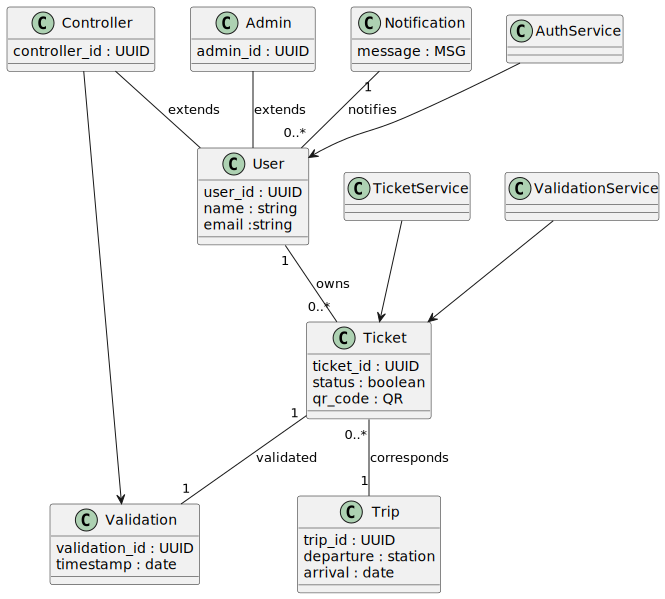

# 💡 Un système de gestion de la billetterie d'un réseau ferroviaire 

**Auteurs (trices) :** Illia VLASENKO - Van Trang DANG - William PLEYERS

## 1. Introduction 
Ce document présente la conception détaillée d’un système de gestion de la billetterie d’un réseau ferroviaire. Il s’inscrit dans la continuité de l’analyse fonctionnelle réalisée en phase D1, dont l’objectif principal était d’identifier les besoins métier, les contraintes du domaine ainsi que les principaux scénarios d’utilisation du système.

Contrairement à cette première phase d’analyse, la présente phase de conception (D2) est orientée vers la technologie cible retenue pour l’implémentation. Son objectif n’est plus seulement de décrire ce que le système doit faire, mais également de préciser comment les composants du système seront organisés, structurés et amenés à collaborer afin de répondre aux exigences identifiées précédemment.

Le système étudié vise à fournir une solution de billetterie numérique permettant à des voyageurs de rechercher un trajet, d’acheter un billet électronique, de consulter ce billet sous forme dématérialisée et de le présenter lors d’un contrôle. En parallèle, il doit permettre aux agents de contrôle de vérifier la validité des billets, y compris dans des situations de connectivité réseau limitée, grâce à un mécanisme de contrôle local et de synchronisation différée avec le serveur central.

Cette phase de conception a donc pour ambition de rendre explicites :

    - les acteurs d’implémentation du système,
    - la structure globale de l’architecture logicielle,
    - les interfaces utilisateur principales,
    - les modèles statiques et dynamiques du système,
    - les scénarios détaillés fondés sur des échanges de données concrets, 
    - les objets critiques manipulés par le système,

Le présent rapport adopte ainsi une approche progressive, allant de la vue générale de la solution vers des éléments de conception plus détaillés, notamment les diagrammes UML, les maquettes d’interfaces, les scénarios d’exécution et les représentations des cycles de vie des objets critiques tels que les billets et les validations.

Enfin, ce document constitue une base de référence pour la future phase d’implémentation. Il vise à garantir la cohérence entre les choix de conception, les contraintes techniques du projet et les besoins fonctionnels identifiés lors de la phase précédente.

## 2. Technologie cible et principes de conception
Dans le cadre de la phase de conception (D2), le système Tou-Tou est défini selon une architecture technique précise, reposant sur des technologies standard du développement logiciel moderne. Le choix de la technologie cible vise à garantir la cohérence entre les modèles UML, les scénarios d’utilisation et leur implémentation future.

### 2.1. Choix de la technologie cible

Le système repose sur une architecture client–serveur structurée autour des composants suivants :

**Backend** : Le serveur applicatif est implémenté à l’aide du framework **Spring Boot** (Java). Ce choix permet de structurer clairement la logique métier en couches distinctes (contrôleurs, services, accès aux données), tout en facilitant la mise en place d’une API REST robuste et évolutive.

**Base de données** : Les données sont stockées dans une base relationnelle **PostgreSQL**. Ce système de gestion de base de données est particulièrement adapté aux contraintes du projet, notamment en ce qui concerne la gestion des relations entre entités (utilisateurs, billets, trajets, validations), la cohérence transactionnelle et la fiabilité des opérations.

**API** : La communication entre les différents composants repose sur une API de type **REST**, utilisant le format JSON pour l’échange de données. Cette approche assure une séparation claire entre les clients (application utilisateur, terminal de contrôle) et le serveur central.

**Clients** : Les interfaces utilisateur sont modélisées sous forme de maquettes (GUI mockups), représentant à la fois une application utilisateur (voyageur) et un terminal de contrôle (contrôleur). Ces interfaces interagissent exclusivement avec le serveur via l’API REST.

### 2.2. Architecture logicielle 

Le système adopte une architecture en couches, permettant de séparer les responsabilités et de garantir la maintenabilité du code. Cette organisation repose sur les principes suivants :

**Couche de présentation (Client)** : Responsable de l’interaction avec l’utilisateur (recherche de trajet, affichage du billet, scan du QR code).

**Couche de contrôleurs (Controller)** : Point d’entrée des requêtes HTTP. Elle assure la réception des appels API et la validation des données entrantes.

**Couche métier (Service)** : Contient la logique applicative du système, notamment la gestion des billets, la validation, la synchronisation et les règles métier associées.

**Couche d’accès aux données (Repository)** : Assure la communication avec la base de données, en garantissant la persistance des entités.

**Base de données** : Constitue la source de vérité du système, en particulier pour l’état global des billets et des validations.

Cette architecture permet de garantir une forte modularité, facilitant ainsi les évolutions futures du système (intégration de nouveaux services, modification des règles métier, montée en charge).

### 2.3. Principes de conception

La conception du système repose sur plusieurs principes fondamentaux issus du génie logiciel :

Séparation des responsabilités (Separation of Concerns) : Chaque composant du système possède un rôle clairement défini, évitant les dépendances fortes entre modules.

Source de vérité centralisée : Le serveur central est l’unique autorité décisionnelle pour la validation des billets. Les terminaux clients ne disposent que d’une logique locale limitée (mode dégradé).

Idempotence des opérations critiques : Les opérations telles que la validation d’un billet sont conçues pour être répétables sans effet secondaire, garantissant la cohérence du système en cas de retransmission ou de synchronisation.

Tolérance aux pannes (résilience) : Le système intègre un mode dégradé permettant de continuer les opérations de contrôle en l’absence de connexion réseau, avec une synchronisation différée.

Scalabilité : L’architecture REST et la séparation des couches permettent une évolution du système vers des environnements à plus forte charge, notamment en cas d’augmentation du nombre d’utilisateurs ou de contrôles simultanés.

## 3. Acteurs d’implémentation du système

Contrairement à la phase d’analyse (D1), dans laquelle les acteurs représentaient principalement des rôles fonctionnels tels que le voyageur, le contrôleur ou l’administrateur, cette section adopte une perspective orientée conception en identifiant les acteurs d’implémentation du système.

Un acteur d’implémentation désigne ici un composant logiciel ou technique participant concrètement au fonctionnement du système. Il peut s’agir d’une interface cliente, d’un service applicatif, d’un composant de persistance ou d’un mécanisme local intervenant dans l’exécution de certaines opérations.

L’objectif de cette section est de présenter ces différents composants, leurs responsabilités respectives ainsi que leur rôle dans l’architecture générale du système de billetterie ferroviaire.

Le système s’articule autour des composants suivants :

    Web App
    Mobile App
    Controller Terminal
    API REST
    Notification Service
    Validation Service
    Ticket Service
    Auth Service
    PostgreSQL DB
    Local Storage

Ces composants sont répartis entre plusieurs niveaux de l’architecture : les interfaces clientes, le backend applicatif, les services métiers, la couche de persistance et le mode hors ligne.

### 3.1. Web App

La Web App constitue l’une des interfaces clientes du système. Elle permet à l’utilisateur d’accéder aux principales fonctionnalités de billetterie depuis un navigateur web.

Elle prend en charge notamment :

    la recherche de trajets,
    la consultation des services disponibles,
    l’authentification de l’utilisateur,
    l’achat et la consultation des billets,
    l’affichage du billet numérique et de son code QR.

Du point de vue de la conception, la Web App joue le rôle d’interface de présentation. Elle transmet les requêtes utilisateur à l’API REST et affiche les résultats retournés par le backend. Elle ne porte pas la logique métier critique, qui reste centralisée côté serveur.

### 3.2. Mobile App
La Mobile App fournit les mêmes grandes fonctionnalités que la Web App, mais dans un environnement mobile. Elle permet au voyageur d’interagir avec le système depuis un smartphone, notamment pour rechercher un trajet, acheter un billet et présenter le QR code associé lors d’un contrôle.

Dans l’architecture du système, la Mobile App communique elle aussi avec l’API REST. Elle constitue donc un second point d’entrée client vers les services métier fournis par le backend.

La présence de deux interfaces clientes distinctes permet d’adapter l’accès au système à plusieurs contextes d’usage tout en conservant une logique centrale unique.

### 3.3. Controller Terminal

Le Controller Terminal correspond au dispositif utilisé par les agents de contrôle pour vérifier les billets présentés par les voyageurs.

Ce composant assure plusieurs fonctions spécifiques :

    - la lecture du code QR,
    - l’envoi de demandes de validation à l’API REST,
    - l’affichage du résultat de contrôle,
    - l’utilisation du mode hors ligne lorsque le réseau n’est pas disponible.

Le terminal de contrôle se distingue des autres interfaces clientes par sa capacité à fonctionner partiellement sans connexion réseau. Dans ce cas, il s’appuie sur un stockage local afin de conserver certaines informations nécessaires au contrôle temporaire des billets.

### 3.4. API REST

L’API REST constitue le point central de communication entre les composants côté client et les services du backend. Elle reçoit les requêtes émises par la Web App, la Mobile App et le Controller Terminal, puis les redirige vers les services applicatifs appropriés.

Elle assure notamment :

    - la réception et le routage des requêtes,
    - l’exposition des fonctionnalités du système,
    - la centralisation des échanges entre les clients et le backend,
    - l’uniformisation de l’accès aux services métier.

Dans l’architecture retenue, l’API REST joue un rôle structurant, car elle constitue l’interface commune entre la couche cliente et la couche applicative.

### 3.5. Notification Service

Le Notification Service est chargé de transmettre certaines informations aux utilisateurs. Il intervient notamment lorsqu’un événement significatif se produit dans le système.

Cela peut concerner, par exemple :

    - l’émission d’un billet,
    - la confirmation d’une opération,
    - l’évolution de l’état d’un billet,
    - certaines alertes ou messages informatifs.

Ce service contribue à améliorer la communication entre le système et l’utilisateur, tout en gardant cette responsabilité distincte des autres services métier.

### 3.6. Validation Service

Le Validation Service prend en charge la logique de vérification des billets. Il constitue un composant central dans le contexte du projet, car il intervient directement dans le processus de contrôle effectué par les agents.

Ses responsabilités incluent :

    - la vérification de la validité d’un billet,
    - l’interprétation des informations issues du QR code,
    - la gestion des opérations de validation en ligne,
    - le traitement des cas de contrôle liés au mode hors ligne,
    - la prise en compte des incohérences ou des conflits éventuels.

Dans une logique de conception, ce service porte donc l’essentiel des règles liées au contrôle des billets et à leur statut dans le système.

### 3.7. Ticket Service

Le Ticket Service regroupe les traitements relatifs à la gestion des billets. Il intervient tout au long du cycle de vie du billet, depuis sa création jusqu’à sa consultation ou son évolution d’état.

Il prend en charge notamment :

    - la création d’un billet après achat,
    - l’association du billet à un utilisateur et à un trajet,
    - la récupération des billets existants,
    - la gestion des informations nécessaires à leur affichage.

Ce service constitue l’un des noyaux métier du système, puisqu’il assure la cohérence des opérations portant directement sur les titres de transport.

### 3.8. Auth Service

Le Auth Service est responsable des mécanismes d’authentification et, plus largement, du contrôle d’accès au système.

Il permet de gérer :

    l’identification des utilisateurs,
    l’accès sécurisé aux fonctionnalités protégées,
    la distinction entre différents types d’utilisateurs ou d’usages.

Ce composant est indispensable pour protéger les opérations sensibles telles que l’accès aux billets personnels, les actions de contrôle ou les traitements internes réservés au backend.

### 3.9. PostgreSQL DB

La PostgreSQL DB constitue la couche de persistance du système. Elle conserve l’ensemble des données nécessaires au fonctionnement global de la billetterie.

Elle stocke notamment : les utilisateurs ; les trajets ; les billets ; les validations ; les informations nécessaires à la cohérence du système.

Dans l’architecture générale, la base de données est utilisée par les services du backend et ne communique pas directement avec les interfaces clientes. Elle garantit la conservation et la cohérence des informations critiques.

### 3.10. Local Storage

Le Local Storage est utilisé dans le cadre du mode hors ligne associé au terminal de contrôle. Il permet de conserver localement certaines données nécessaires au fonctionnement temporaire du système lorsque le réseau n’est pas disponible.

Ce stockage local peut être mobilisé pour :

    - conserver des informations utiles au contrôle local,
    - mémoriser certaines opérations effectuées hors ligne,
    - permettre une continuité de service partielle en cas d’interruption de connexion.

Le Local Storage ne constitue pas une autorité métier autonome. Il s’agit d’un composant de support, destiné à améliorer la résilience du système dans un contexte d’exploitation réel.

### 3.11. Analyse globale des interactions

L’ensemble des acteurs d’implémentation présentés ci-dessus s’inscrit dans une architecture structurée autour de plusieurs principes :

    - les interfaces clientes (Web App, Mobile App, Controller Terminal) servent de points d’entrée pour les utilisateurs ;
    - l’API REST centralise les échanges entre les interfaces et les services internes ;
    - les services métier (Notification Service, Validation Service, Ticket Service, Auth Service) assurent le traitement applicatif ;
    - la PostgreSQL DB garantit la persistance des données ;
    - le Local Storage permet une continuité partielle du fonctionnement du terminal de contrôle en mode hors ligne.

Cette répartition permet d’assurer une séparation claire des responsabilités, une bonne lisibilité de l’architecture ainsi qu’une cohérence avec les diagrammes présentés dans les sections suivantes.

## 4. Architecture générale du système
### 4.1. Diagramme d’architecture

Le diagramme d’architecture présente l’organisation logique du système de billetterie ferroviaire. Celui-ci repose sur une structure client–serveur dans laquelle plusieurs interfaces clientes communiquent avec un backend centralisé par l’intermédiaire d’une API REST.

Côté client, trois points d’entrée principaux sont identifiés : la Web App, la Mobile App et le Controller Terminal. Les deux premières interfaces sont destinées au voyageur et permettent l’accès aux fonctionnalités classiques de consultation et d’achat. Le terminal de contrôle est, quant à lui, utilisé par les agents pour la vérification des billets.

Toutes les requêtes émises par ces composants transitent par l’API REST, qui constitue le point central de communication du système. Cette API redistribue ensuite les traitements vers les différents services métier du backend, à savoir le Notification Service, le Validation Service, le Ticket Service et le Auth Service. Chacun de ces services prend en charge une responsabilité spécifique : gestion des billets, vérification des validations, authentification des utilisateurs ou diffusion de notifications.

L’ensemble de ces services s’appuie sur une couche de persistance représentée par la PostgreSQL DB, qui stocke les données critiques du système. En parallèle, le diagramme met également en évidence un mécanisme de mode hors ligne, reposant sur un Local Storage associé au terminal de contrôle. Ce composant permet de conserver temporairement certaines informations utiles lorsque le réseau n’est pas disponible.

Ainsi, ce diagramme met en évidence une architecture modulaire, centralisée autour du backend, dans laquelle les responsabilités sont clairement séparées entre interfaces clientes, services applicatifs, persistance des données et support local au fonctionnement hors ligne.

### 4.2. Diagramme de déploiement

Le diagramme de déploiement présente la répartition physique des différents composants logiciels sur les supports d’exécution du système. Il complète le diagramme d’architecture en montrant non plus seulement les rôles logiques des composants, mais également leur emplacement dans l’environnement d’exécution.

Le système distingue d’abord trois environnements côté utilisateur. La Mobile App est déployée sur un smartphone utilisateur, tandis que la Web App est accessible depuis un navigateur web. Le Controller Terminal est, quant à lui, déployé sur un appareil dédié au contrôle, qui dispose également d’un Local Storage permettant la conservation de données utiles en cas d’indisponibilité du réseau.

Les traitements principaux sont centralisés sur un Backend Server, au sein duquel se trouvent l’API REST et les services applicatifs. Le backend reçoit les requêtes provenant des différents clients, coordonne les traitements métiers et interagit avec la couche de persistance.

Les données du système sont stockées sur un Database Server distinct, hébergeant la PostgreSQL DB. Cette séparation entre serveur applicatif et serveur de base de données permet de distinguer clairement les responsabilités d’exécution et de persistance.

Ce diagramme montre ainsi que le système repose sur une répartition cohérente entre clients, terminal de contrôle, serveur applicatif et serveur de données. Il met également en évidence la particularité du terminal de contrôle, seul composant à disposer d’un stockage local, ce qui reflète directement les exigences du projet en matière de fonctionnement hors ligne.

### 4.3. Processus internes
#### 4.3.1. Processus interne lié à l’achat d’un billet

Le premier diagramme d’activité illustre le processus interne associé à l’achat d’un billet. Il débute par une recherche de trajet effectuée par l’utilisateur, suivie de l’affichage des services disponibles et de la vérification des places restantes. Si un trajet est sélectionné et que des places sont disponibles, le système poursuit le traitement par une simulation de paiement. En cas de succès, plusieurs opérations internes sont alors déclenchées : génération d’un identifiant unique de billet, création du code QR, enregistrement du billet dans la base de données, association du billet à l’utilisateur, puis envoi d’une notification. Ce diagramme met ainsi en évidence la chaîne de traitements internes qui permet de transformer une intention d’achat en billet effectivement émis par le système.

#### 4.3.2.Processus interne lié à la validation d’un billet

Le second diagramme d’activité représente le processus interne de validation d’un billet lors d’un contrôle. Après le scan du code QR, le système distingue deux cas selon la disponibilité du réseau. En mode connecté, le billet est transmis au serveur, qui vérifie sa validité avant de retourner une décision de validation ou de signaler un problème. En mode hors ligne, le terminal effectue une pré-validation locale, stocke les informations nécessaires, puis attend le rétablissement de la connexion afin de finaliser le traitement. Une fois la connectivité rétablie, le système reprend le processus de vérification et produit une décision finale. Ce diagramme met en évidence la logique interne de continuité de service, ainsi que l’articulation entre contrôle local temporaire et validation centralisée.

## 5. Interface utilisateur – GUI Mockups

## 6. Modèle statique - Class Diagrams
 

## 7. Scénarios d’utilisation détaillés 

# Diagramme Achat d'un Ticket

# Diagramme Validation d'un Ticket

# Diagramme Gestion Offline

# Diagramme Synchronisation après Offline

# Diagramme Expiration d'un Ticket

# Diagramme Gestion de Double Scan

# Diagramme Gestion de Connexion

## 8. Diagrammes d'Objet pour données critiques
### 8.1. Diagramme d'Objet Gestion de Validation 
Ce diagramme d’objet illustre un exemple concret de situation de validation d’un billet dans le système. Il met en relation un utilisateur, un contrôleur et un billet déjà validé. L’objectif de cette représentation est de montrer, à travers des instances précises, comment un billet peut être associé à un utilisateur tout en étant pris en charge dans un contexte de contrôle. Le statut VALIDATED indique ici que le billet a déjà été reconnu comme valide par le système, ce qui permet d’illustrer l’état d’un billet après une opération de validation réussie.

### 8.2. Diagramme d'Objet Pré-validation
Ce diagramme représente une situation de pré-validation dans un contexte hors ligne. Le terminal fonctionne ici en mode OFFLINE et manipule un billet avant toute validation définitive par le serveur central. Cette représentation permet d’illustrer le comportement local du système lorsqu’une connexion réseau n’est pas disponible. Elle met en évidence le fait qu’un terminal peut conserver temporairement des informations sur un billet afin de poursuivre le contrôle dans un mode dégradé, avant une éventuelle synchronisation ultérieure avec le backend.

### 8.3 Diagramme d'Objet Double Vérification
Ce diagramme d’objet montre un cas de double vérification d’un même billet. Le billet ticket1 apparaît ici comme déjà validé, avec une référence explicite au premier contrôleur ayant effectué la validation. Deux validations distinctes sont cependant représentées, ce qui permet d’illustrer une situation potentiellement conflictuelle dans laquelle plusieurs opérations de contrôle concernent le même billet. Cette représentation est utile pour matérialiser les cas où le système doit détecter une seconde tentative de validation et préserver la cohérence de l’état global du billet.

