# 💡 Un système de gestion de la billetterie d'un réseau ferroviaire 

**Auteurs (trices) :** Illia VLASENKO - Van Trang DANG - William PLEYERS

## 1. Introduction 
Ce document présente la conception détaillée d’un système de gestion de la billetterie d’un réseau ferroviaire. Il s’inscrit dans la continuité de l’analyse fonctionnelle réalisée en phase D1, dont l’objectif principal était d’identifier les besoins métier, les contraintes du domaine ainsi que les principaux scénarios d’utilisation du système.

Contrairement à cette première phase d’analyse, la présente phase de conception (D2) est orientée vers la technologie cible retenue pour l’implémentation. Son objectif n’est plus seulement de décrire ce que le système doit faire, mais également de préciser comment les composants du système seront organisés, structurés et amenés à collaborer afin de répondre aux exigences identifiées précédemment.

Le système étudié vise à fournir une solution de billetterie numérique permettant à des voyageurs de rechercher un trajet, d’acheter un billet électronique, de consulter ce billet sous forme dématérialisée et de le présenter lors d’un contrôle. En parallèle, il doit permettre aux agents de contrôle de vérifier la validité des billets, y compris dans des situations de connectivité réseau limitée, grâce à un mécanisme de contrôle local et de synchronisation différée avec le serveur central.

Cette phase de conception a donc pour ambition de rendre explicites :

    - les acteurs d’implémentation du système,
    - la structure globale de l’architecture logicielle,
    - les interfaces utilisateur principales,
    - les modèles statiques et dynamiques du système,
    - les scénarios détaillés fondés sur des échanges de données concrets, 
    - les objets critiques manipulés par le système,

Le présent rapport adopte ainsi une approche progressive, allant de la vue générale de la solution vers des éléments de conception plus détaillés, notamment les diagrammes UML, les maquettes d’interfaces, les scénarios d’exécution et les représentations des cycles de vie des objets critiques tels que les billets et les validations.

Enfin, ce document constitue une base de référence pour la future phase d’implémentation. Il vise à garantir la cohérence entre les choix de conception, les contraintes techniques du projet et les besoins fonctionnels identifiés lors de la phase précédente.

## 2. Technologie cible et principes de conception
Dans le cadre de la phase de conception (D2), le système Tou-Tou est défini selon une architecture technique précise, reposant sur des technologies standard du développement logiciel moderne. Le choix de la technologie cible vise à garantir la cohérence entre les modèles UML, les scénarios d’utilisation et leur implémentation future.

### 2.1. Choix de la technologie cible

Le système repose sur une architecture client–serveur structurée autour des composants suivants :

**Backend** : Le serveur applicatif est implémenté à l’aide du framework **Spring Boot** (Java). Ce choix permet de structurer clairement la logique métier en couches distinctes (contrôleurs, services, accès aux données), tout en facilitant la mise en place d’une API REST robuste et évolutive.

**Base de données** : Les données sont stockées dans une base relationnelle **PostgreSQL**. Ce système de gestion de base de données est particulièrement adapté aux contraintes du projet, notamment en ce qui concerne la gestion des relations entre entités (utilisateurs, billets, trajets, validations), la cohérence transactionnelle et la fiabilité des opérations.

**API** : La communication entre les différents composants repose sur une API de type **REST**, utilisant le format JSON pour l’échange de données. Cette approche assure une séparation claire entre les clients (application utilisateur, terminal de contrôle) et le serveur central.

**Clients** : Les interfaces utilisateur sont modélisées sous forme de maquettes (GUI mockups), représentant à la fois une application utilisateur (voyageur) et un terminal de contrôle (contrôleur). Ces interfaces interagissent exclusivement avec le serveur via l’API REST.

### 2.2. Architecture logicielle 

Le système adopte une architecture en couches, permettant de séparer les responsabilités et de garantir la maintenabilité du code. Cette organisation repose sur les principes suivants :

**Couche de présentation (Client)** : Responsable de l’interaction avec l’utilisateur (recherche de trajet, affichage du billet, scan du QR code).

**Couche de contrôleurs (Controller)** : Point d’entrée des requêtes HTTP. Elle assure la réception des appels API et la validation des données entrantes.

**Couche métier (Service)** : Contient la logique applicative du système, notamment la gestion des billets, la validation, la synchronisation et les règles métier associées.

**Couche d’accès aux données (Repository)** : Assure la communication avec la base de données, en garantissant la persistance des entités.

**Base de données** : Constitue la source de vérité du système, en particulier pour l’état global des billets et des validations.

Cette architecture permet de garantir une forte modularité, facilitant ainsi les évolutions futures du système (intégration de nouveaux services, modification des règles métier, montée en charge).

### 2.3. Principes de conception

La conception du système repose sur plusieurs principes fondamentaux issus du génie logiciel :

Séparation des responsabilités (Separation of Concerns) : Chaque composant du système possède un rôle clairement défini, évitant les dépendances fortes entre modules.

Source de vérité centralisée : Le serveur central est l’unique autorité décisionnelle pour la validation des billets. Les terminaux clients ne disposent que d’une logique locale limitée (mode dégradé).

Idempotence des opérations critiques : Les opérations telles que la validation d’un billet sont conçues pour être répétables sans effet secondaire, garantissant la cohérence du système en cas de retransmission ou de synchronisation.

Tolérance aux pannes (résilience) : Le système intègre un mode dégradé permettant de continuer les opérations de contrôle en l’absence de connexion réseau, avec une synchronisation différée.

Scalabilité : L’architecture REST et la séparation des couches permettent une évolution du système vers des environnements à plus forte charge, notamment en cas d’augmentation du nombre d’utilisateurs ou de contrôles simultanés.

## 3. Acteurs d’implémentation du système

Contrairement à la phase d’analyse (D1), dans laquelle les acteurs représentaient principalement des rôles fonctionnels tels que le voyageur, le contrôleur ou l’administrateur, cette section adopte une perspective orientée conception en identifiant les acteurs d’implémentation du système.

Un acteur d’implémentation désigne ici un composant logiciel ou technique participant concrètement au fonctionnement du système. Il peut s’agir d’une interface cliente, d’un service applicatif, d’un composant de persistance ou d’un mécanisme local intervenant dans l’exécution de certaines opérations.

L’objectif de cette section est de présenter ces différents composants, leurs responsabilités respectives ainsi que leur rôle dans l’architecture générale du système de billetterie ferroviaire.

Le système s’articule autour des composants suivants :

    Web App
    Mobile App
    Controller Terminal
    API REST
    Notification Service
    Validation Service
    Ticket Service
    Auth Service
    PostgreSQL DB
    Local Storage

Ces composants sont répartis entre plusieurs niveaux de l’architecture : les interfaces clientes, le backend applicatif, les services métiers, la couche de persistance et le mode hors ligne.

### 3.1. Web App

La Web App constitue l’une des interfaces clientes du système. Elle permet à l’utilisateur d’accéder aux principales fonctionnalités de billetterie depuis un navigateur web.

Elle prend en charge notamment :

    la recherche de trajets,
    la consultation des services disponibles,
    l’authentification de l’utilisateur,
    l’achat et la consultation des billets,
    l’affichage du billet numérique et de son code QR.

Du point de vue de la conception, la Web App joue le rôle d’interface de présentation. Elle transmet les requêtes utilisateur à l’API REST et affiche les résultats retournés par le backend. Elle ne porte pas la logique métier critique, qui reste centralisée côté serveur.

### 3.2. Mobile App
La Mobile App fournit les mêmes grandes fonctionnalités que la Web App, mais dans un environnement mobile. Elle permet au voyageur d’interagir avec le système depuis un smartphone, notamment pour rechercher un trajet, acheter un billet et présenter le QR code associé lors d’un contrôle.

Dans l’architecture du système, la Mobile App communique elle aussi avec l’API REST. Elle constitue donc un second point d’entrée client vers les services métier fournis par le backend.

La présence de deux interfaces clientes distinctes permet d’adapter l’accès au système à plusieurs contextes d’usage tout en conservant une logique centrale unique.

### 3.3. Controller Terminal

Le Controller Terminal correspond au dispositif utilisé par les agents de contrôle pour vérifier les billets présentés par les voyageurs.

Ce composant assure plusieurs fonctions spécifiques :

    - la lecture du code QR,
    - l’envoi de demandes de validation à l’API REST,
    - l’affichage du résultat de contrôle,
    - l’utilisation du mode hors ligne lorsque le réseau n’est pas disponible.

Le terminal de contrôle se distingue des autres interfaces clientes par sa capacité à fonctionner partiellement sans connexion réseau. Dans ce cas, il s’appuie sur un stockage local afin de conserver certaines informations nécessaires au contrôle temporaire des billets.

### 3.4. API REST

L’API REST constitue le point central de communication entre les composants côté client et les services du backend. Elle reçoit les requêtes émises par la Web App, la Mobile App et le Controller Terminal, puis les redirige vers les services applicatifs appropriés.

Elle assure notamment :

    - la réception et le routage des requêtes,
    - l’exposition des fonctionnalités du système,
    - la centralisation des échanges entre les clients et le backend,
    - l’uniformisation de l’accès aux services métier.

Dans l’architecture retenue, l’API REST joue un rôle structurant, car elle constitue l’interface commune entre la couche cliente et la couche applicative.

### 3.5. Notification Service

Le Notification Service est chargé de transmettre certaines informations aux utilisateurs. Il intervient notamment lorsqu’un événement significatif se produit dans le système.

Cela peut concerner, par exemple :

    - l’émission d’un billet,
    - la confirmation d’une opération,
    - l’évolution de l’état d’un billet,
    - certaines alertes ou messages informatifs.

Ce service contribue à améliorer la communication entre le système et l’utilisateur, tout en gardant cette responsabilité distincte des autres services métier.

### 3.6. Validation Service

Le Validation Service prend en charge la logique de vérification des billets. Il constitue un composant central dans le contexte du projet, car il intervient directement dans le processus de contrôle effectué par les agents.

Ses responsabilités incluent :

    - la vérification de la validité d’un billet,
    - l’interprétation des informations issues du QR code,
    - la gestion des opérations de validation en ligne,
    - le traitement des cas de contrôle liés au mode hors ligne,
    - la prise en compte des incohérences ou des conflits éventuels.

Dans une logique de conception, ce service porte donc l’essentiel des règles liées au contrôle des billets et à leur statut dans le système.

### 3.7. Ticket Service

Le Ticket Service regroupe les traitements relatifs à la gestion des billets. Il intervient tout au long du cycle de vie du billet, depuis sa création jusqu’à sa consultation ou son évolution d’état.

Il prend en charge notamment :

    - la création d’un billet après achat,
    - l’association du billet à un utilisateur et à un trajet,
    - la récupération des billets existants,
    - la gestion des informations nécessaires à leur affichage.

Ce service constitue l’un des noyaux métier du système, puisqu’il assure la cohérence des opérations portant directement sur les titres de transport.

### 3.8. Auth Service

Le Auth Service est responsable des mécanismes d’authentification et, plus largement, du contrôle d’accès au système.

Il permet de gérer :

    l’identification des utilisateurs,
    l’accès sécurisé aux fonctionnalités protégées,
    la distinction entre différents types d’utilisateurs ou d’usages.

Ce composant est indispensable pour protéger les opérations sensibles telles que l’accès aux billets personnels, les actions de contrôle ou les traitements internes réservés au backend.

### 3.9. PostgreSQL DB

La PostgreSQL DB constitue la couche de persistance du système. Elle conserve l’ensemble des données nécessaires au fonctionnement global de la billetterie.

Elle stocke notamment : les utilisateurs ; les trajets ; les billets ; les validations ; les informations nécessaires à la cohérence du système.

Dans l’architecture générale, la base de données est utilisée par les services du backend et ne communique pas directement avec les interfaces clientes. Elle garantit la conservation et la cohérence des informations critiques.

### 3.10. Local Storage

Le Local Storage est utilisé dans le cadre du mode hors ligne associé au terminal de contrôle. Il permet de conserver localement certaines données nécessaires au fonctionnement temporaire du système lorsque le réseau n’est pas disponible.

Ce stockage local peut être mobilisé pour :

    - conserver des informations utiles au contrôle local,
    - mémoriser certaines opérations effectuées hors ligne,
    - permettre une continuité de service partielle en cas d’interruption de connexion.

Le Local Storage ne constitue pas une autorité métier autonome. Il s’agit d’un composant de support, destiné à améliorer la résilience du système dans un contexte d’exploitation réel.

### 3.11. Analyse globale des interactions

L’ensemble des acteurs d’implémentation présentés ci-dessus s’inscrit dans une architecture structurée autour de plusieurs principes :

    - les interfaces clientes (Web App, Mobile App, Controller Terminal) servent de points d’entrée pour les utilisateurs ;
    - l’API REST centralise les échanges entre les interfaces et les services internes ;
    - les services métier (Notification Service, Validation Service, Ticket Service, Auth Service) assurent le traitement applicatif ;
    - la PostgreSQL DB garantit la persistance des données ;
    - le Local Storage permet une continuité partielle du fonctionnement du terminal de contrôle en mode hors ligne.

Cette répartition permet d’assurer une séparation claire des responsabilités, une bonne lisibilité de l’architecture ainsi qu’une cohérence avec les diagrammes présentés dans les sections suivantes.

## 4. Architecture générale du système
### 4.1. Diagramme d’architecture

Le diagramme d’architecture présente l’organisation logique du système de billetterie ferroviaire. Celui-ci repose sur une structure client–serveur dans laquelle plusieurs interfaces clientes communiquent avec un backend centralisé par l’intermédiaire d’une API REST.

Côté client, trois points d’entrée principaux sont identifiés : la Web App, la Mobile App et le Controller Terminal. Les deux premières interfaces sont destinées au voyageur et permettent l’accès aux fonctionnalités classiques de consultation et d’achat. Le terminal de contrôle est, quant à lui, utilisé par les agents pour la vérification des billets.

Toutes les requêtes émises par ces composants transitent par l’API REST, qui constitue le point central de communication du système. Cette API redistribue ensuite les traitements vers les différents services métier du backend, à savoir le Notification Service, le Validation Service, le Ticket Service et le Auth Service. Chacun de ces services prend en charge une responsabilité spécifique : gestion des billets, vérification des validations, authentification des utilisateurs ou diffusion de notifications.

L’ensemble de ces services s’appuie sur une couche de persistance représentée par la PostgreSQL DB, qui stocke les données critiques du système. En parallèle, le diagramme met également en évidence un mécanisme de mode hors ligne, reposant sur un Local Storage associé au terminal de contrôle. Ce composant permet de conserver temporairement certaines informations utiles lorsque le réseau n’est pas disponible.

Ainsi, ce diagramme met en évidence une architecture modulaire, centralisée autour du backend, dans laquelle les responsabilités sont clairement séparées entre interfaces clientes, services applicatifs, persistance des données et support local au fonctionnement hors ligne.

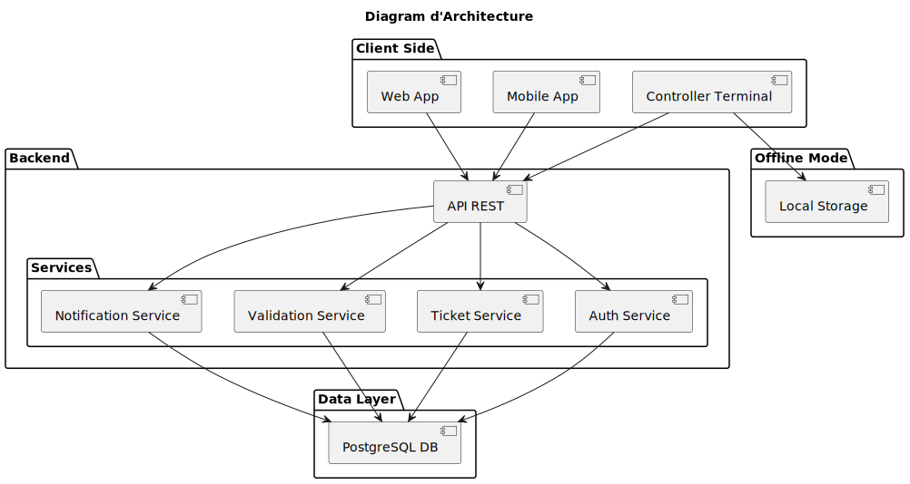

### 4.2. Diagramme de déploiement

Le diagramme de déploiement présente la répartition physique des différents composants logiciels sur les supports d’exécution du système. Il complète le diagramme d’architecture en montrant non plus seulement les rôles logiques des composants, mais également leur emplacement dans l’environnement d’exécution.

Le système distingue d’abord trois environnements côté utilisateur. La Mobile App est déployée sur un smartphone utilisateur, tandis que la Web App est accessible depuis un navigateur web. Le Controller Terminal est, quant à lui, déployé sur un appareil dédié au contrôle, qui dispose également d’un Local Storage permettant la conservation de données utiles en cas d’indisponibilité du réseau.

Les traitements principaux sont centralisés sur un Backend Server, au sein duquel se trouvent l’API REST et les services applicatifs. Le backend reçoit les requêtes provenant des différents clients, coordonne les traitements métiers et interagit avec la couche de persistance.

Les données du système sont stockées sur un Database Server distinct, hébergeant la PostgreSQL DB. Cette séparation entre serveur applicatif et serveur de base de données permet de distinguer clairement les responsabilités d’exécution et de persistance.

Ce diagramme montre ainsi que le système repose sur une répartition cohérente entre clients, terminal de contrôle, serveur applicatif et serveur de données. Il met également en évidence la particularité du terminal de contrôle, seul composant à disposer d’un stockage local, ce qui reflète directement les exigences du projet en matière de fonctionnement hors ligne.

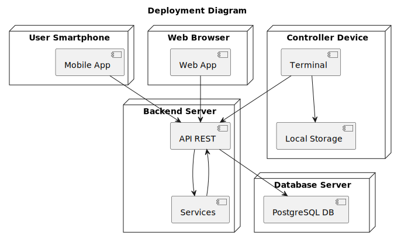

### 4.3. Processus internes
#### 4.3.1. Processus interne lié à l’achat d’un billet

Le premier diagramme d’activité illustre le processus interne associé à l’achat d’un billet. Il débute par une recherche de trajet effectuée par l’utilisateur, suivie de l’affichage des services disponibles et de la vérification des places restantes. Si un trajet est sélectionné et que des places sont disponibles, le système poursuit le traitement par une simulation de paiement. En cas de succès, plusieurs opérations internes sont alors déclenchées : génération d’un identifiant unique de billet, création du code QR, enregistrement du billet dans la base de données, association du billet à l’utilisateur, puis envoi d’une notification. Ce diagramme met ainsi en évidence la chaîne de traitements internes qui permet de transformer une intention d’achat en billet effectivement émis par le système.

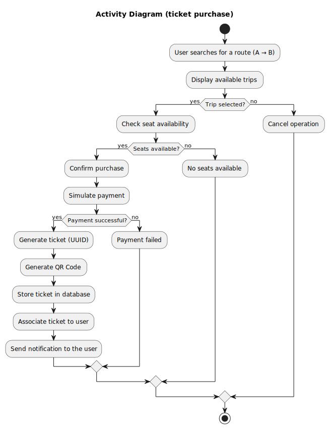

#### 4.3.2.Processus interne lié à la validation d’un billet

Le second diagramme d’activité représente le processus interne de validation d’un billet lors d’un contrôle. Après le scan du code QR, le système distingue deux cas selon la disponibilité du réseau. En mode connecté, le billet est transmis au serveur, qui vérifie sa validité avant de retourner une décision de validation ou de signaler un problème. En mode hors ligne, le terminal effectue une pré-validation locale, stocke les informations nécessaires, puis attend le rétablissement de la connexion afin de finaliser le traitement. Une fois la connectivité rétablie, le système reprend le processus de vérification et produit une décision finale. Ce diagramme met en évidence la logique interne de continuité de service, ainsi que l’articulation entre contrôle local temporaire et validation centralisée.

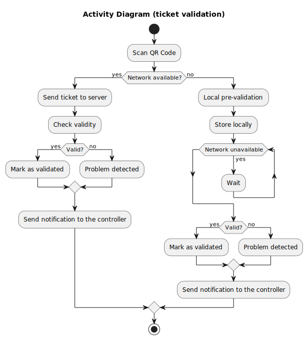

## 5. Interface utilisateur – GUI Mockups

## 6. Modèle statique - Diagramme de classes
Le diagramme de classes présente une architecture organisée en plusieurs couches, permettant de structurer clairement les responsabilités du système.

La couche des contrôleurs (API REST) constitue le point d’entrée du système. Elle reçoit les requêtes des utilisateurs et délègue le traitement aux services sans contenir de logique métier.

La couche des services applicatifs regroupe les principaux traitements fonctionnels du système, notamment la gestion des billets (TicketService), la validation (ValidationService), l’expiration automatique (ExpirationService), ainsi que les notifications. Ces services implémentent directement les scénarios d’utilisation décrits précédemment.

La couche domaine contient les entités métier fondamentales telles que User, Ticket, Trip et Validation. Elle représente le cœur logique du système et reste indépendante des choix techniques.

La couche de persistance (repositories) assure l’accès aux données stockées dans PostgreSQL, en s’appuyant sur les mécanismes fournis par Spring Boot.

Enfin, le système intègre un composant externe (COTS), ZXing, utilisé pour la génération des QR codes.

Cette architecture permet de garantir une bonne séparation des responsabilités, une forte cohérence avec les scénarios métier, ainsi qu’une maintenabilité et une évolutivité du système.

 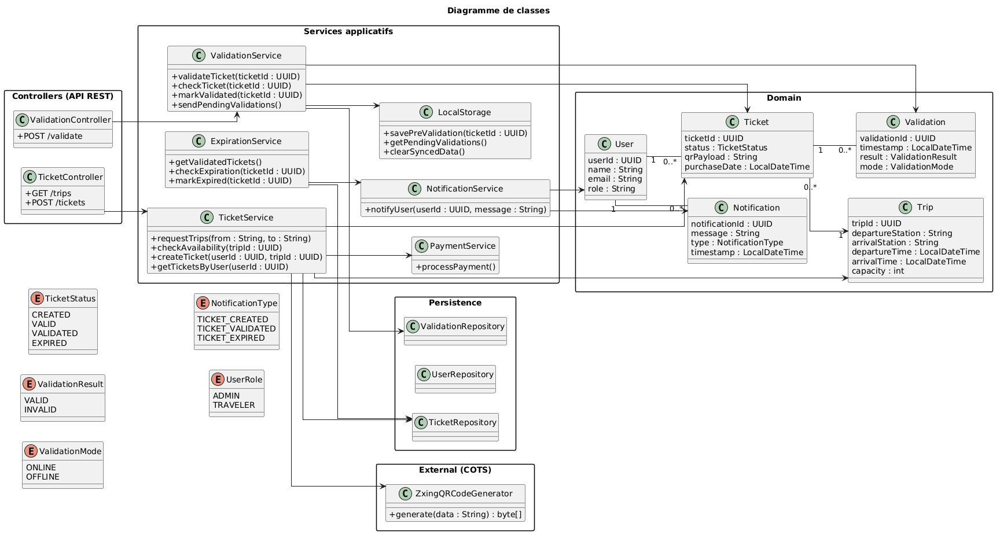

## 7. Scénarios d’utilisation détaillés 
### 7.1 Achat d'un Ticket
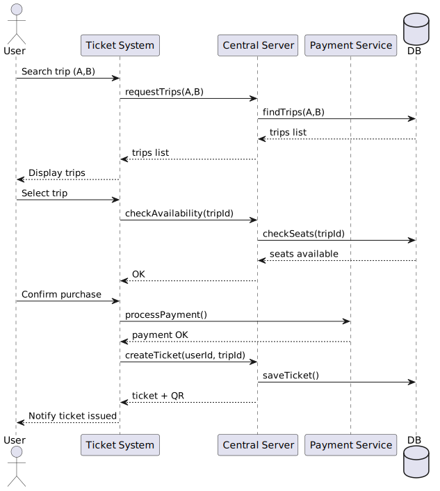
#### 7.1.1. Objectif du scénario

Ce scénario décrit le processus complet d’achat d’un billet électronique dans le système de billetterie Tou-Tou, depuis la recherche d’un trajet jusqu’à l’émission finale du ticket avec son code QR. Il s’agit d’un scénario fondamental, car il constitue le point d’entrée du cycle de vie d’un billet et met en jeu plusieurs composants majeurs de l’architecture : l’interface utilisateur, le serveur central, le service de paiement, la base de données ainsi que le service de génération de QR code.

Du point de vue fonctionnel, ce scénario permet à un voyageur de rechercher un trajet entre deux points du réseau ferroviaire, de vérifier la disponibilité des places, de confirmer un achat, puis de recevoir un billet numérique exploitable lors d’un contrôle.

Du point de vue technique, ce scénario illustre la collaboration entre les couches du système :

    - la couche de présentation, représentée par l’application client,
    - la couche métier, représentée par le serveur central,
    - la couche de persistance, représentée par la base de données,
    - ainsi qu’un composant externe simulé pour la validation du paiement.

Ce scénario met donc en évidence la manière dont les échanges de données concrets s’articulent avec le modèle statique défini dans le diagramme de classes.

#### 7.1.2. Acteurs et composants impliqués

Le scénario d’achat met en jeu les acteurs et composants suivants :

    - User : acteur humain à l’origine de la demande d’achat ;
    - Ticket System : interface cliente ou façade applicative recevant les actions de l’utilisateur ;
    - Central Server : composant principal chargé de la logique métier ;
    - Payment Service : service externe simulé utilisé pour valider le paiement;
    - DB: base de données persistante du système.

Au niveau du diagramme de classes, ce scénario mobilise principalement les classes suivantes :

    - User : représente l’utilisateur qui initie l’achat ;
    - Trip : représente le trajet sélectionné ;
    - Ticket : billet généré à l’issue du processus ;
    - TicketService : service chargé de la recherche des trajets, de la vérification de disponibilité et de la création du billet ;
    - PaymentService : service simulant la confirmation de paiement ;
    - TicketRepository : abstraction de persistance du billet ;
    - ZxingQRCodeGenerator : composant externe générant le QR code ;
    - TicketStatus : énumération définissant l’état du billet.

#### 7.1.3. Préconditions

Avant l’exécution de ce scénario, plusieurs conditions doivent être satisfaites :

    - le voyageur dispose d’un compte utilisateur valide ;
    - le système est accessible et le serveur central est disponible ;
    - le réseau ferroviaire ainsi que les trajets sont déjà configurés dans la base de données ;
    - le service de paiement simulé est opérationnel ;
    - la base de données contient au moins un ensemble de trajets consultables.

Ces préconditions garantissent que l’achat peut être réalisé dans un contexte nominal.

#### 7.1.4. Données manipulées dans le scénario

Le scénario manipule plusieurs catégories de données issues du modèle statique.

**Données d’entrée :**

    - ville de départ (de)
    - ville d’arrivée (à)
    - identifiant du trajet sélectionné (tripId)
    - identifiant de l’utilisateur (userId)

**Données intermédiaires :**

    - liste des trajets retournés par la recherche
    - état de disponibilité des places pour le trajet choisi
    - réponse du service de paiement (validated ou échec)

**Données produites :**

    - nouvel objet 'Ticket'
    - identifiant unique du billet (ticketId)
    - statut initial du billet (CREATED puis VALID)
    - contenu du QR code (qrPayload)
    - date d’achat (purchaseDate)

Ces données correspondent directement aux attributs décrits dans les classes User, Trip et Ticket.

#### 7.1.5. Déroulement détaillé du scénario

##### a) Recherche de trajet

Le scénario débute lorsque l’utilisateur lance une recherche de trajet dans l’application cliente en renseignant un point de départ et un point d’arrivée. Le `Ticket System` reçoit l’action utilisateur `Search trip (A,B)` et transmet une requête métier au `Central Server` via l’appel : 'requestTrips(A,B)'
À ce stade, la donnée échangée est une paire de chaînes de caractères correspondant aux stations de départ et d’arrivée. Le serveur central interprète cette demande comme une requête de consultation sur les trajets disponibles.

Le Central Server interroge ensuite la base de données via : `findTrips(A,B)`

Cette opération consiste à rechercher dans l’ensemble des objets Trip les instances dont departureStation = A et arrivalStation = B, ou plus généralement les trajets répondant aux critères métiers définis.

La base de données renvoie une liste de trajets compatibles. Chaque élément de cette liste correspond à une instance de la classe `Trip`, contenant notamment : tripId ; departureStation ; arrivalStation ; departureTime  arrivalTime ; capacity

Le serveur central renvoie ensuite cette liste au `Ticket System`, qui l’affiche à l’utilisateur sous une forme exploitable.

##### b) Sélection du trajet et vérification de disponibilité

Après affichage des résultats, l’utilisateur sélectionne un trajet précis. Cette action déclenche une seconde requête envoyée au serveur : `checkAvailability(tripId)`

Le but de cette étape est de vérifier que le trajet choisi possède encore des places disponibles et peut donc donner lieu à une émission de billet.

Le Central Server consulte alors la base de données à l’aide d’une opération du type : `checkSeats(tripId)`

Cette vérification repose sur les données métier liées à la capacité du trajet et au nombre de billets déjà émis pour celui-ci. Le système peut, par exemple, comparer : Trip.capacity ou nombre de Ticket déjà associés au même tripId. Si la capacité n’est pas atteinte, la base retourne un état positif (seats available) au serveur central, qui répond alors OK au client.

Cette étape est importante car elle permet de garantir la cohérence entre l’état métier du trajet et les droits d’achat encore disponibles.

##### c) Confirmation d’achat et paiement

Une fois la disponibilité confirmée, l’utilisateur valide son intention d’achat via l’action Confirm purchase.

Le Ticket System transmet alors une demande de paiement au composant externe :
`processPayment()`

Dans le cadre du projet, le service de paiement est simulé. Il ne s’appuie pas sur une infrastructure bancaire réelle, mais son rôle est néanmoins essentiel dans le scénario : il conditionne le passage à la phase de création du billet.

Le Payment Service retourne alors une réponse de type : payment OK

Cette réponse indique au système que le paiement est accepté et que l’émission du billet peut se poursuivre.

À ce niveau, la logique du scénario suit une règle forte : aucun billet ne doit être créé tant que le paiement n’a pas été confirmé.

##### d) Création du billet

Après validation du paiement, le Ticket System demande au serveur central de créer un billet en appelant : `createTicket(userId, tripId)`

Le serveur central instancie alors un nouvel objet Ticket à partir des données suivantes :

    ticketId : identifiant unique généré par le système ;
    userId : référence vers l’utilisateur acheteur ;
    tripId : référence vers le trajet sélectionné ;
    purchaseDate : horodatage de la transaction ;
    status : valeur initiale du billet ;
    qrPayload : donnée encodée dans le futur QR code.

Dans une implémentation cohérente avec le diagramme de classes, le TicketService prend en charge cette création métier. Il peut également faire appel au composant ZxingQRCodeGenerator afin de produire une représentation encodable du billet.

Le billet est ensuite persisté dans la base via : `saveTicket()`

Cette étape garantit que le ticket existe désormais comme donnée persistante du système et pourra être retrouvé plus tard lors d’un contrôle.

##### e) Génération et retour du QR code

Une fois le billet enregistré, le système prépare les données de sortie renvoyées au client. Le serveur central transmet au Ticket System : {ticket + QR}

Ce retour contient au minimum :

    l’identifiant du billet ;
    son statut ;
    son QR code ou la donnée permettant de l’afficher ;
    éventuellement les informations synthétiques du trajet.

Le Ticket System peut alors notifier l’utilisateur que le billet a bien été émis.

Cette dernière étape clôt le scénario nominal. Le billet est désormais consultable, stocké côté serveur, et prêt à être utilisé dans les scénarios suivants, notamment la validation en ligne ou hors ligne.

#### 7.1.6. Analyse des échanges de données

Ce scénario est particulièrement intéressant car il met en évidence plusieurs types d’échanges de données concrets.

Entre le client et le serveur :

    paramètres de recherche (de, à)
    identifiant de trajet (tripId)
    identifiant utilisateur (userId)
    données de réponse (liste de trajets, confirmation d’achat, ticket généré)

Entre le serveur et la base de données :

    requêtes de recherche de trajets
    consultation de disponibilité
    persistance du billet créé

Entre le serveur et les composants externes :

    demande de paiement
    génération éventuelle du QR code

Ces échanges montrent que le système suit une architecture en couches cohérente :

    le client ne manipule pas directement la logique métier,
    le serveur central orchestre les décisions,
    la base de données conserve les états persistants,
    les composants externes restent découplés des entités métier.
#### 7.1.7. Cohérence avec le diagramme de classes

Le scénario d’achat est directement aligné avec le diagramme de classes.

    - La classe User intervient comme entité initiatrice du scénario.
    - La classe Trip fournit les données affichées lors de la recherche.
    - La classe Ticket est créée lors de la confirmation de paiement.
    - Le TicketService orchestre les opérations de recherche, de disponibilité et de création.
    - Le TicketRepository assure la persistance.
    - Le PaymentService et le ZxingQRCodeGenerator apparaissent comme composants auxiliaires.
    - Le statut du billet utilise l’énumération TicketStatus, ce qui rend explicite l’évolution de l’objet dans le système.

Cette correspondance entre scénario dynamique et modèle statique constitue précisément l’un des objectifs attendus dans la phase D2.

#### 7.1.8. Hypothèses de conception

Pour simplifier le projet et garder un périmètre réaliste, plusieurs hypothèses sont retenues dans ce scénario :

    - le paiement est toujours simulé ;
    - le calcul du trajet est limité à un réseau prédéfini ;
    - la disponibilité est vérifiée au moment de l’achat ;
    - le QR code est généré immédiatement après création du billet ;
    - un billet est associé à un seul utilisateur et à un seul trajet.

Ces hypothèses permettent de stabiliser le modèle et de concentrer la conception sur les mécanismes essentiels.

#### 7.1.9. Limites et points d’attention

Plusieurs limites ou risques potentiels apparaissent dans ce scénario :

    - une perte de connexion après confirmation du paiement peut nécessiter une logique d’idempotence ;
    - deux achats concurrents sur le même trajet peuvent créer une tension sur la disponibilité si les transactions ne sont pas correctement gérées ;
    - un QR code mal structuré ou généré sans signature suffisante peut affaiblir la sécurité globale du système.

Ces points devront être traités soit dans les scénarios alternatifs, soit dans l’implémentation technique finale.

### 7.2 Validation d'un Ticket
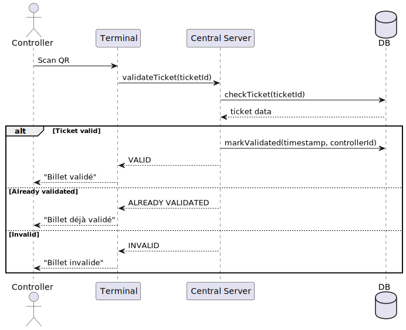
#### 7.2.1. Objectif du scénario

Ce scénario décrit le processus de validation d’un billet électronique dans le cas nominal où le terminal de contrôle dispose d’une connexion réseau active avec le serveur central. Il intervient après la création du billet et correspond à l’étape où un contrôleur vérifie si le titre présenté par le voyageur est authentique, encore valable et non déjà utilisé.

L’objectif principal de ce scénario est double. D’une part, il permet de confirmer en temps réel qu’un billet peut être accepté pour le trajet concerné. D’autre part, il garantit que la validation effective d’un billet n’est enregistrée qu’une seule fois, ce qui constitue une exigence essentielle pour la cohérence du système et la prévention de la fraude.

Du point de vue architectural, ce scénario met en évidence l’interaction entre le terminal de contrôle, le serveur central et la base de données. Contrairement au scénario d’achat, il ne repose pas sur un service externe comme le paiement, mais sur une logique métier interne forte : vérification de l’état du billet, décision de validation, enregistrement de la trace de contrôle et retour immédiat au contrôleur.

Ce scénario joue un rôle fondamental dans le système global, car il matérialise l’utilisation effective du billet. Il constitue également la base de comparaison pour les scénarios suivants de validation hors ligne, de synchronisation différée et de détection de conflits.

#### 7.2.2. Acteurs et composants impliqués

Le scénario met en jeu les acteurs et composants suivants :

    - Controller: agent humain chargé d’effectuer le contrôle du billet ;
    - Terminal : application ou terminal de contrôle manipulé par le contrôleur;
    - Central Server : composant central chargé de la logique de validation ;
    - DB : base de données contenant l’état courant des billets et des validations.

Du point de vue du diagramme de classes, ce scénario mobilise en particulier :

    - ValidationController : point d’entrée API côté backend pour les demandes de validation ;
    - ValidationService : service chargé d’orchestrer la logique de vérification et de validation ;
    - ValidationRepository : couche de persistance utilisée pour stocker les validations ;
    - TicketRepository : couche de persistance utilisée pour récupérer l’état du billet ;
    - Ticket : entité représentant le billet à contrôler ;
    - Validation : entité représentant la trace de validation enregistrée ;
    - ValidationResult et ValidationMode : énumérations décrivant respectivement le résultat et le mode du contrôle ;
    - TicketStatus : énumération représentant l’état courant du billet.

L’interaction entre ces composants permet de faire correspondre le scénario dynamique de contrôle avec la structure statique du système.

#### 7.2.3. Préconditions

Avant l’exécution de ce scénario, plusieurs conditions doivent être réunies :

    - un billet a déjà été créé et stocké dans le système ;
    - le billet présenté par le voyageur possède un identifiant exploitable à partir du QR code ;
    - le terminal du contrôleur est connecté au réseau ;
    - le serveur central est accessible ;
    - la base de données contient l’état courant du billet à contrôler ;
    - le billet est associé à un trajet existant et à un utilisateur identifié.

Ces préconditions permettent d’assurer que le processus de validation en ligne peut être exécuté de manière fiable.

#### 7.2.4. Données manipulées dans le scénario

Le scénario repose sur des échanges de données relativement ciblés, mais critiques.

**Données d’entrée :**

    - identifiant du billet extrait du QR code (ticketId) ;
    - identifiant du contrôleur (controllerId) ;
    - horodatage du contrôle (timestamp).

**Données intermédiaires :**

    - état courant du billet (status) ;
    - informations associées au billet (ticket data) ;
    - trace de validation antérieure, si elle existe déjà.

**Données produites :**

        - nouvelle instance de 'Validation' en cas de validation réussie ;
        - mise à jour éventuelle du statut du billet ;
        - retour de résultat au terminal : 'VALID', 'ALREADY VALIDATED' ou 'INVALID'.

Ces données correspondent directement aux attributs présents dans les entités `Ticket` et `Validation` du diagramme de classes.

#### 7.2.5. Déroulement détaillé du scénario

##### a) Scan du billet

Le scénario débute lorsque le contrôleur scanne le QR code présenté par le voyageur. Cette action est représentée dans le diagramme par le message : `Scan QR`

Le terminal extrait alors l’identifiant logique du billet à partir du contenu du QR code. Dans une implémentation réaliste, cette étape peut inclure une vérification de format ou une première vérification d’intégrité, mais dans le scénario nominal en ligne, la décision finale est toujours déléguée au serveur central.

Le terminal envoie ensuite une demande de validation au serveur central à travers l’appel : `validateTicket(ticketId)`

Cette requête constitue l’entrée principale du scénario. Elle transmet au backend l’identifiant du billet à analyser, éventuellement accompagné de métadonnées complémentaires (identifiant du terminal ou du contrôleur).

##### b) Vérification du billet côté serveur

À réception de la requête, le serveur central déclenche une vérification interne via : `checkTicket(ticketId)`

Cette opération consiste à consulter dans la base de données toutes les informations utiles au contrôle du billet. Le résultat renvoyé, noté ticket data dans le diagramme, peut inclure :

    l’existence ou non du billet ;
    l’identifiant du trajet auquel il correspond ;
    son état actuel (CREATED, VALID, VALIDATED, EXPIRED) ;
    les éventuelles validations déjà enregistrées.

Cette étape est fondamentale car elle permet de transformer une simple lecture de QR code en décision métier fondée sur la source de vérité centrale du système.

##### c) Cas nominal : billet valide

Le premier cas traité dans le bloc alt est celui où le billet est reconnu comme valable et non encore validé.

Le système exécute alors l’opération : `markValidated(timestamp, controllerId)`.
Cette action représente l’enregistrement officiel de la validation dans la base de données. Concrètement, elle peut impliquer deux effets :

    la création d’une nouvelle instance de Validation avec :
    un validationId,
    un timestamp,
    un result = VALID,
    un mode = ONLINE ;
    la mise à jour éventuelle du statut du Ticket vers VALIDATED.

Une fois l’écriture terminée, le serveur central renvoie au terminal le statut :VALID. Le terminal affiche alors le message :"Billet validé"

Cette branche du scénario correspond à la situation normale attendue. Elle garantit qu’un billet effectivement utilisé est enregistré comme tel dans le système central.

##### d) Cas alternatif : billet déjà validé

Le second cas traité est celui où le billet existe bien, mais qu’il possède déjà une validation enregistrée.

Dans cette situation, le serveur ne crée aucune nouvelle validation et retourne simplement le résultat : "ALREADY VALIDATED". Le terminal affiche alors : "Billet déjà validé"

Cette branche est importante car elle exprime l’une des règles métier les plus fortes du système : un même billet ne doit pas être validé deux fois.

Du point de vue du diagramme de classes, cela se traduit par le fait qu’un Ticket peut avoir plusieurs traces de contrôle dans un sens large, mais qu’au niveau métier une seule validation effective doit faire foi pour son utilisation normale. Cette contrainte sera réexaminée plus en détail dans les scénarios de double scan et de synchronisation.

##### e) Cas alternatif : billet invalide

Le troisième cas du bloc alt correspond à une situation où le billet ne peut pas être accepté. Cela peut se produire si :

    le billet n’existe pas ;
    le QR code renvoie vers un identifiant inconnu ;
    le billet est expiré ;
    le billet n’est pas valide pour le contexte de contrôle.

Dans ce cas, le serveur retourne : "INVALID". Le terminal affiche alors : "Billet invalide"

Aucune validation n’est enregistrée et aucune modification persistante n’est effectuée sur le système.

#### 7.2.6. Analyse des échanges de données

Le scénario de validation en ligne est court en apparence, mais il manipule des données critiques.

**Entre le terminal et le serveur** :

    - transmission de ticketId ;
    - réception d’un résultat métier (VALID, ALREADY VALIDATED, INVALID) ;
    - transmission implicite du contexte de validation.

**Entre le serveur et la base de données** :

    - lecture de l’état du billet via checkTicket(ticketId) ;
    - écriture d’une validation en cas d’acceptation via markValidated(...).

Ces échanges montrent que le terminal n’est pas décisionnaire : il ne fait que transmettre les informations au backend et afficher le résultat. Le serveur central concentre toute la logique de validation, ce qui garantit une forte cohérence métier.

#### 7.2.7. Cohérence avec le diagramme de classes

Ce scénario correspond très directement au modèle statique.

    - La classe Ticket fournit les données lues et vérifiées par le serveur.
    - La classe Validation représente la trace créée lors d’une validation acceptée.
    - Le ValidationService correspond au traitement principal du scénario.
    - Le ValidationRepository assure la persistance de la validation.
    - Le TicketRepository permet la consultation de l’état du billet.
    - L’énumération ValidationResult permet d’exprimer clairement les résultats possibles du contrôle.
    - L’énumération ValidationMode permet d’indiquer que le contrôle s’effectue ici en ligne.

Cette correspondance renforce la cohérence globale entre le diagramme de classes et les diagrammes de séquence.

#### 7.2.8. Hypothèses de conception

Le scénario repose sur plusieurs hypothèses simplificatrices :

    - le QR code est correctement lu par le terminal ;
    - la connexion réseau entre le terminal et le serveur est disponible ;
    - la base de données est cohérente et accessible ;
    - l’identifiant du contrôleur est connu du système ;
    - la validation est traitée immédiatement et de manière synchrone.

Ces hypothèses définissent le cadre nominal. Les cas dégradés seront traités dans les scénarios suivants.

#### 7.2.9. Limites et points d’attention

Plusieurs points de vigilance apparaissent dans ce scénario :

    - en cas d’indisponibilité réseau, le processus ne peut pas être terminé en ligne ;
    - en cas de forte simultanéité, deux contrôleurs peuvent théoriquement tenter de valider presque en même temps le même billet ;
    - la qualité de la validation dépend de l’intégrité des données stockées en base ;
    - l’affichage terminal doit être suffisamment clair pour éviter les erreurs d’interprétation par le contrôleur.

Ces limites justifient l’existence des scénarios complémentaires de validation hors ligne, de synchronisation différée et de détection de double scan.

### 7.3. Gestion Offline

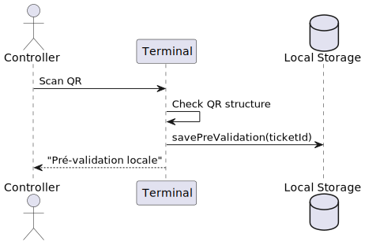

#### 7.3.1. Objectif du scénario

Ce scénario décrit le fonctionnement du système lorsqu’un contrôleur doit vérifier un billet dans une situation où la connexion réseau avec le serveur central est indisponible. Il s’agit d’un cas de fonctionnement dégradé, mais néanmoins essentiel dans le contexte d’un réseau ferroviaire réel, où les coupures de réseau peuvent être fréquentes, notamment dans les tunnels, les zones mal couvertes ou lors de périodes de forte saturation.

L’objectif principal de ce scénario est de permettre au contrôleur de poursuivre son activité de contrôle malgré l’absence temporaire de connectivité, tout en préservant l’intégrité du modèle métier. Plus précisément, il s’agit :

    - de vérifier localement la structure du QR code ;
    - de déterminer si le billet semble exploitable d’un point de vue purement technique ;
    - d’enregistrer une trace locale de ce contrôle sous forme de pré-validation ;
    - de reporter toute validation définitive à une phase ultérieure de synchronisation avec le serveur central.

Ce scénario est donc un mécanisme de résilience. Il ne remplace pas la validation centrale, mais permet de maintenir un niveau minimal de service lorsque les conditions techniques ne permettent pas un contrôle en ligne complet.

#### 7.3.2. Acteurs et composants impliqués

Le scénario mobilise les éléments suivants :

    - Controller : agent humain effectuant le contrôle ;
    - Terminal : terminal utilisé par le contrôleur pour scanner le billet ;
    - Local Storage : espace de stockage local du terminal, utilisé pour enregistrer les pré-validations hors ligne.

Du point de vue du diagramme de classes, ce scénario s’appuie principalement sur :

    - ValidationService : logique applicative liée au contrôle du billet ;
    - LocalStorage : composant chargé de stocker les validations différées ;
    - Validation : entité représentant la trace du contrôle ;
    - Ticket : entité correspondant au billet présenté ;
    - ValidationMode : enum permettant d’indiquer que le contrôle a été réalisé en mode OFFLINE.

Le serveur central n’apparaît pas directement dans ce diagramme de séquence, précisément parce qu’il n’est pas joignable au moment du contrôle. Cela constitue la différence fondamentale avec le scénario précédent de validation en ligne.

#### 7.3.3. Préconditions

Les conditions nécessaires à l’exécution de ce scénario sont les suivantes :

    - un voyageur présente un billet sous forme de QR code ;
    - le terminal du contrôleur est opérationnel et peut lire le QR code ;
    - la connexion réseau avec le serveur central est indisponible ou jugée non exploitable ;
    - le terminal dispose d’un mécanisme local de stockage permettant de conserver temporairement les validations réalisées hors ligne.

Ces préconditions définissent le contexte exact du scénario : un environnement dégradé, mais toujours fonctionnel du point de vue opérationnel.

#### 7.3.4. Données manipulées dans le scénario

Le scénario met en jeu un nombre réduit de données, mais ces dernières sont critiques pour la cohérence future du système.

**Données d’entrée :**

    - contenu du QR code présenté par le voyageur ;
    - identifiant du billet extrait du QR (ticketId) ;
    - horodatage local du contrôle.

**Données intermédiaires :**

    - résultat de la vérification structurelle du QR code ;
    - statut local associé au billet.

**Données produites :**

    - enregistrement local d’une pré-validation ;
    - trace technique permettant une synchronisation ultérieure avec le serveur central.

Ces données sont cohérentes avec les classes `Ticket`, `Validation` et `LocalStorage` du diagramme de classes.

#### 7.3.5. Déroulement détaillé du scénario

##### a) Scan du billet

Le scénario débute lorsque le contrôleur scanne le QR code présenté par le voyageur. Cette action est modélisée dans le diagramme par le message : `Scan QR`

Le terminal récupère alors les informations encodées dans le QR code. Dans le cadre du projet, ces informations correspondent à un identifiant de billet ou à une structure minimale permettant de retrouver ce billet.

À ce stade, aucune communication avec le serveur central n’est possible. Le terminal doit donc prendre en charge un traitement autonome limité.

##### b) Vérification de la structure du QR code

Une fois le QR code lu, le terminal exécute une vérification locale représentée par : `Check QR structure`

Cette étape consiste à vérifier que les données lues sont cohérentes d’un point de vue syntaxique et technique. Selon les choix de conception retenus, cela peut inclure : la validité du format ; la présence d’un identifiant exploitable et une éventuelle vérification de signature ou de structure interne.

Il est important de souligner que cette vérification locale ne constitue pas une validation complète du billet. Elle ne permet pas de savoir si le billet est déjà validé, expiré, ou frauduleusement réutilisé ailleurs. Elle permet uniquement de déterminer si le contenu du QR semble techniquement recevable.

##### c) Enregistrement d’une pré-validation locale

Si le terminal considère que le QR code est structurellement correct, il procède à l’enregistrement d’une pré-validation locale via l’appel : `savePreValidation(ticketId)`

Cet appel transmet au composant Local Storage l’information minimale nécessaire pour conserver une trace du contrôle réalisé hors ligne. L’enregistrement peut contenir :

    l’identifiant du billet ;
    un horodatage local ;
    l’identifiant du terminal ou du contrôleur ;
    un mode de validation égal à OFFLINE.

Dans une implémentation alignée avec le diagramme de classes, cette opération correspond à la création d’un objet Validation ou d’une structure équivalente, stockée temporairement dans LocalStorage jusqu’à la prochaine synchronisation.

L’objectif n’est donc pas de modifier l’état métier officiel du billet, mais de constituer un journal temporaire fiable qui pourra être rejoué ensuite vers le serveur central.

##### d) Retour d’information au contrôleur

Une fois la pré-validation enregistrée localement, le terminal renvoie au contrôleur le message :"Pré-validation locale". Ce message signifie que :

    - le contrôle a bien été pris en compte localement ;
    - le billet semble acceptable au regard des vérifications minimales disponibles ;
    - la décision finale sera confirmée ou rejetée lors de la synchronisation future.

Ce retour d’information permet au contrôleur de continuer son activité sans interruption, malgré l’absence de réseau. Il s’agit donc d’une solution intermédiaire entre la validation stricte en ligne et l’absence totale de contrôle.

#### 7.3.6. Analyse des échanges de données

Contrairement aux scénarios précédents, ce scénario n’implique aucun échange avec la base de données centrale ni avec le serveur principal. Tous les échanges sont locaux :

    - lecture du QR code entre le voyageur et le terminal ;
    - traitement interne sur le terminal ;
    - enregistrement dans Local Storage.

Le scénario est donc caractérisé par une décentralisation temporaire de l’exécution, mais non de la vérité métier. En effet :

    - la décision finale n’est pas prise localement ;
    - l’état officiel du billet n’est pas modifié ;
    - aucune validation globale n’est créée à ce stade.

Cette distinction est essentielle pour garantir que le fonctionnement hors ligne ne compromette pas la cohérence du système global.

#### 7.3.7. Cohérence avec le diagramme de classes

Le scénario hors ligne est en cohérence avec le modèle statique présenté précédemment.

    - Le ValidationService prend en charge la logique applicative du contrôle local.
    - Le composant LocalStorage est explicitement mobilisé pour enregistrer les validations différées.
    - Les entités Ticket et Validation restent au cœur du scénario, même si leur mise à jour complète est différée.
    - L’enum ValidationMode permet de distinguer clairement ce scénario des validations en ligne.

Le diagramme de classes fournit donc la structure nécessaire pour supporter ce cas de fonctionnement dégradé, tandis que le diagramme de séquence montre comment cette structure est mobilisée dynamiquement.

#### 7.3.8. Hypothèses de conception

Le scénario repose sur plusieurs hypothèses simplificatrices :

    - le terminal est capable de lire correctement le QR code ;
    - le stockage local est disponible et fiable ;
    - la vérification locale reste limitée à un contrôle de structure ;
    - le serveur central n’est pas accessible au moment du contrôle ;
    - la synchronisation des données locales sera possible ultérieurement.

Ces hypothèses sont réalistes dans le cadre du projet et permettent de modéliser un mode hors ligne crédible sans complexifier excessivement le système.

#### 7.3.9. Limites et points d’attention

Ce scénario présente plusieurs limites qu’il convient de signaler :

    - un billet structurellement correct peut malgré tout être déjà validé ou expiré ;
    - un même billet peut potentiellement être pré-validé plusieurs fois hors ligne sur différents terminaux ;
    - l’horodatage local peut être moins fiable que l’horodatage serveur ;
    - une corruption du stockage local pourrait entraîner une perte partielle des validations en attente.

Ces limites justifient l’existence du scénario suivant, consacré à la synchronisation des validations hors ligne avec le serveur central.

### 7.4. Synchronisation après Offline

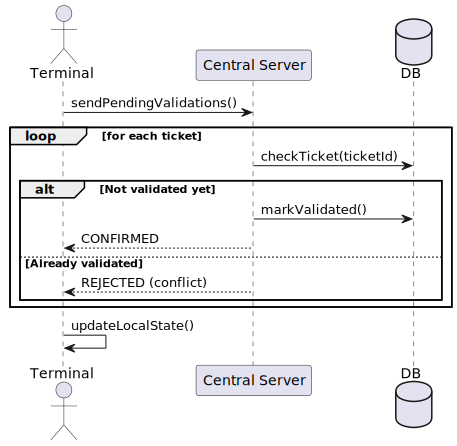

#### 7.4.1. Objectif du scénario

Ce scénario décrit le mécanisme de synchronisation entre le terminal de contrôle et le serveur central après une période de fonctionnement en mode hors ligne. Il intervient lorsque plusieurs pré-validations ont été enregistrées localement sur un terminal et que la connectivité réseau est rétablie.

L’objectif principal de ce scénario est de transférer vers le serveur central les validations accumulées localement, de les confronter à l’état réel des billets stockés en base, puis de décider pour chacune d’elles si elle peut être confirmée ou si elle doit être rejetée comme conflit.

Ce scénario joue un rôle déterminant dans l’architecture du système, car il assure la jonction entre le mode dégradé et la source de vérité centrale. Il permet à la fois :

    - de restaurer la cohérence globale du système ;
    - de finaliser les contrôles réalisés hors ligne ;
    - de détecter les cas de validation concurrente ou de réutilisation frauduleuse ;
    - d’actualiser l’état local du terminal après arbitrage par le serveur central.

Du point de vue métier, il s’agit donc d’un scénario de régularisation. Du point de vue technique, il met en évidence une logique de traitement différé, fondée sur des échanges de données structurés et sur la résolution de conflits.

#### 7.4.2. Acteurs et composants impliqués

Le scénario mobilise les composants suivants :

    - Terminal : terminal de contrôle contenant des validations locales en attente de synchronisation ;
    - Central Server : serveur central chargé d’arbitrer les validations différées ;
    - DB : base de données centrale contenant l’état global des billets et des validations.

Au niveau du diagramme de classes, les éléments principaux concernés sont :

    - ValidationService : service applicatif chargé de traiter les validations ;
    - LocalStorage : composant contenant les validations offline en attente ;
    - ValidationRepository : composant de persistance utilisé pour enregistrer les validations confirmées ;
    - TicketRepository : composant permettant de consulter l’état actuel du billet ;
    - Validation : entité représentant la validation réalisée localement ;
    - Ticket : entité métier dont l’état est examiné puis éventuellement mis à jour.

Ce scénario ne fait pas intervenir directement l’utilisateur final. Il s’agit d’un traitement interne entre les composants techniques du système, déclenché par le retour du réseau.

#### 7.4.3. Préconditions

Les préconditions associées à ce scénario sont les suivantes :

    - le terminal contient au moins une pré-validation enregistrée localement ;
    - la connectivité entre le terminal et le serveur central est rétablie ;
    - le serveur central et la base de données sont disponibles ;
    - les données locales n’ont pas été perdues ou corrompues ;
    - chaque pré-validation contient au minimum un identifiant de billet et un horodatage local.

Ces conditions sont nécessaires pour que le processus de synchronisation puisse être engagé dans des conditions cohérentes.

#### 7.4.4. Données manipulées dans le scénario

Le scénario manipule un ensemble de données plus riche que les scénarios précédents, car il traite plusieurs validations successives.

**Données d’entrée :**

    - liste des validations locales en attente ;
    - pour chaque validation : ticketId, horodatage local, identifiant du terminal ou du contrôleur, mode de validation (`OFFLINE`).

**Données consultées côté serveur :**

    - état actuel du billet (Ticket.status) ;
    - historique des validations déjà enregistrées ;
    - existence éventuelle d’une validation globale antérieure.

**Données produites :**

    - validation globale confirmée ou rejetée ;
    - réponse envoyée au terminal (CONFIRMED ou REJECTED) ;
    - mise à jour de l’état local après synchronisation.

#### 7.4.5. Déroulement détaillé du scénario

##### a) Déclenchement de la synchronisation

Le scénario commence lorsque le terminal détecte le retour de la connectivité ou lorsqu’une commande explicite de synchronisation est lancée. Le terminal envoie alors au serveur central une demande de synchronisation représentée par : `sendPendingValidations()`.

Cette requête ne porte pas sur un seul billet, mais sur un ensemble de validations locales accumulées pendant la période hors ligne. Le terminal agit ici comme un émetteur différé de contrôles qui n’avaient pas pu être finalisés précédemment.

##### b) Traitement itératif des validations

Le diagramme indique qu’une boucle est exécutée : `loop [for each ticket]`

Cela signifie que le serveur central traite chaque validation locale indépendamment. Pour chaque billet concerné, le serveur consulte l’état courant via l’appel : `checkTicket(ticketId)`

Cette opération permet de déterminer si le billet a déjà été validé ou non au niveau global. Elle s’appuie sur les données de la base centrale, qui constitue la source de vérité du système.

Le serveur récupère ainsi les informations suivantes :

    - existence du billet ;
    - statut actuel ;
    - présence éventuelle d’une validation antérieure ;
    - historique déjà connu des contrôles.

Cette étape est essentielle, car elle permet d’évaluer chaque validation locale non pas isolément, mais à la lumière de l’état global du système.

##### c) Cas nominal : billet non encore validé

Le premier cas du bloc alt correspond à la situation où le billet n’a pas encore été validé dans la base centrale.

Le serveur peut alors accepter la validation locale et l’inscrire officiellement dans le système. Cela est représenté par l’appel `markValidated()`

Cette opération traduit la transformation d’une pré-validation locale en validation globale officielle. Elle implique généralement :

    - la création d’une instance de Validation en base ;
    - l’enregistrement du mode (OFFLINE, mais synchronisé ensuite) ;
    - l’horodatage de la décision côté serveur ;
    - la mise à jour éventuelle du statut du billet.

Une fois cette opération effectuée, le serveur renvoie au terminal le message :CONFIRMED

Le terminal comprend alors que la validation locale a été reconnue comme légitime par le système central.

##### d) Cas alternatif : billet déjà validé

Le second cas du bloc alt correspond à la situation où le billet a déjà été validé dans la base avant la synchronisation du terminal.

Le serveur rejette alors la validation en attente et renvoie : REJECTED (conflict). Ce rejet signifie que la pré-validation locale est en conflit avec l’état global du système. Plusieurs causes peuvent expliquer ce cas :

    - le billet a déjà été validé en ligne sur un autre terminal ;
    - le billet a été pré-validé hors ligne sur un autre terminal, puis synchronisé plus tôt ;
    - le même billet a été utilisé plusieurs fois ;
    - une tentative de fraude ou de double présentation est survenue.

Dans tous les cas, le serveur central ne crée pas de seconde validation officielle. Il rejette la validation locale en tant que conflit.

##### e) Mise à jour de l’état local

Une fois tous les billets traités, le terminal met à jour son propre état local : `updateLocalState()`

Cette étape consiste à nettoyer ou adapter le stockage local en fonction des réponses reçues. Le terminal peut notamment :

    marquer comme synchronisées les validations confirmées ;
    conserver une trace des validations rejetées ;
    supprimer certaines entrées déjà traitées ;
    préparer un état propre pour les futurs contrôles hors ligne.

Cette phase est importante car elle évite une resynchronisation incohérente lors d’une future reconnexion.

#### 7.4.6. Analyse des échanges de données

Le scénario de synchronisation met en jeu des échanges plus riches que les scénarios précédents, car il ne traite pas une seule opération immédiate, mais une liste de validations différées.

**Entre le terminal et le serveur** :

    - envoi d’un ensemble de validations locales ;
    - réception de réponses détaillées (CONFIRMED / REJECTED) ;
    - mise à jour de l’état local à partir des décisions du serveur.

**Entre le serveur et la base de données** :

    - consultation de l’état des billets ;
    - vérification de l’existence de validations antérieures ;
    - enregistrement des validations reconnues.

Ces échanges traduisent une logique distribuée particulière : le terminal collecte localement les contrôles, mais seul le serveur est habilité à les officialiser.

#### 7.4.7. Cohérence avec le diagramme de classes

Ce scénario s’inscrit de manière cohérente dans le modèle statique du système.

    - La classe LocalStorage représente le point de départ du scénario, puisqu’elle conserve les validations en attente.
    - Le ValidationService porte la logique d’arbitrage lors de la synchronisation.
    - Le ValidationRepository permet l’écriture des validations confirmées.
    - Le TicketRepository permet d’interroger l’état réel du billet.
    - Les classes Ticket et Validation sont au cœur des décisions prises.
    - Le statut et le mode de validation sont exprimés au moyen des enums déjà définis dans le diagramme de classes.

Cette cohérence montre que le scénario n’introduit pas de logique supplémentaire non modélisée. Il exploite simplement les composants déjà présents dans l’architecture.

#### 7.4.8. Hypothèses de conception

Le scénario repose sur les hypothèses suivantes :

    - les validations locales sont stockées dans un format exploitable et non corrompu ;
    - l’ordre de traitement des validations est stable ;
    - le serveur central dispose d’une vue cohérente et à jour des billets ;
    - la synchronisation traite chaque billet de manière atomique ;
    - le système préfère la cohérence globale à la simple conservation de toutes les validations locales.

Ces hypothèses permettent de simplifier la logique tout en garantissant un comportement robuste.

#### 7.4.9. Limites et points d’attention

Ce scénario soulève plusieurs points sensibles :

    - deux terminaux peuvent avoir enregistré localement le même billet presque au même moment ;
    - les horodatages locaux peuvent différer du temps serveur ;
    - une validation locale rejetée peut générer une ambiguïté opérationnelle si le contrôleur avait laissé passer le voyageur ;
    - la mise à jour locale doit être fiable pour éviter un renvoi en boucle des mêmes validations.

Ces limites montrent que la synchronisation est un scénario critique, car il concentre les problématiques de cohérence distribuée, de gestion des conflits et de fiabilité technique.

### 7.5. Expiration d'un Ticket

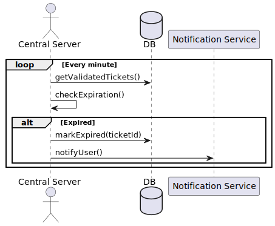

#### 7.5.1. Objectif du scénario

Ce scénario décrit le mécanisme automatique par lequel le système Tou-Tou détecte les billets dont la période de validité est terminée et met à jour leur état en conséquence. Contrairement aux scénarios précédents, il ne repose pas sur une action directe d’un utilisateur ou d’un contrôleur, mais sur un traitement interne déclenché périodiquement par le serveur central.

L’objectif principal de ce scénario est de garantir que l’état des billets reflète en permanence leur validité réelle dans le temps. Il permet notamment :

    - d’identifier les billets encore actifs dont la fenêtre d’utilisation est dépassée ;
    - de marquer ces billets comme expirés dans la base de données ;
    - d’informer automatiquement l’utilisateur concerné ;
    - de maintenir la cohérence globale du cycle de vie des billets.

Ce scénario joue un rôle important dans la fiabilité du système, car il empêche qu’un billet ancien ou déjà hors délai puisse être traité comme encore valable lors d’un futur contrôle.

#### 7.5.2. Acteurs et composants impliqués

Le scénario implique les éléments suivants :

    - Central Server : composant interne déclenchant et exécutant le traitement périodique ;
    - DB : base de données contenant l’ensemble des billets et de leurs états ;
    - Notification Service : service chargé d’envoyer une information à l’utilisateur après expiration effective.

Dans le diagramme de classes, ce scénario correspond principalement aux composants suivants :

    - ExpirationService : service responsable de la vérification temporelle des billets ;
    - TicketRepository : composant de persistance utilisé pour lire et mettre à jour les billets ;
    - NotificationService : service applicatif utilisé pour informer l’utilisateur ;
    - Ticket : entité métier dont l’état évolue ;
    - TicketStatus : enum permettant d’exprimer clairement l’état "EXPIRED".

Ce scénario met donc en évidence l’existence de processus internes autonomes dans l’architecture du système, indépendants des interactions directes avec les interfaces clientes.

#### 7.5.3. Préconditions

Les préconditions de ce scénario sont les suivantes :

    - le système contient des billets déjà créés et potentiellement encore actifs ;
    - le serveur central exécute périodiquement une tâche de vérification ;
    - les données temporelles des billets et des trajets sont disponibles en base ;
    - la base de données et le service de notification sont accessibles.

Ces conditions garantissent que la tâche d’expiration peut être exécutée dans un contexte cohérent et exploitable.

#### 7.5.4. Données manipulées dans le scénario

Le scénario traite essentiellement des données liées au temps et à l’état des billets.

**Données d’entrée :**

    - ensemble des billets dont le statut n’est pas encore expiré ;
    - heure courante du système ;
    - informations temporelles associées aux trajets ou aux billets.

**Données intermédiaires :**

    - liste des billets considérés comme encore actifs ;
    - résultat de la comparaison entre l’heure courante et la fenêtre de validité ;
    - décision d’expiration ou non pour chaque billet.

**Données produites :**

    - mise à jour du statut du billet en EXPIRED ;
    - horodatage implicite de la mise à jour ;
    - notification adressée à l’utilisateur.

Ces données correspondent aux entités `Ticket`, `Trip` et `Notification`, ainsi qu’à l’énumération `TicketStatus`.

#### 7.5.5. Déroulement détaillé du scénario

##### a) Déclenchement périodique du traitement

Le diagramme montre que le processus s’exécute dans une boucle : `loop [Every minute]`

Cela signifie qu’une tâche planifiée est lancée à intervalles réguliers par le serveur central. Dans une implémentation concrète, cette tâche peut être réalisée par un scheduler interne, mais dans le cadre du scénario, elle est simplement modélisée comme un traitement cyclique autonome.

L’objectif de cette périodicité est de détecter rapidement les billets dont la validité a pris fin, sans attendre une action extérieure.

##### b) Récupération des billets à surveiller

À chaque cycle, le serveur central interroge la base de données à l’aide de l’appel : getValidatedTickets().Cet appel permet de récupérer l’ensemble des billets qui sont encore considérés comme actifs du point de vue métier. Selon la logique exacte du système, il peut s’agir des billets au statut "VALID" ou éventuellement des billets déjà "VALIDATED" mais dont la fenêtre temporelle n’est pas encore clôturée.

La base renvoie donc un ensemble de tickets devant être examinés pour déterminer s’ils doivent ou non être expirés.

##### c) Vérification de la validité temporelle

Le serveur central déclenche ensuite l’opération :checkExpiration(). Cette opération consiste à évaluer, pour chaque billet concerné, si sa fenêtre de validité est dépassée. Cette logique peut s’appuyer sur plusieurs éléments :

    - l’heure actuelle du système ;
    - la date et l’heure du trajet associé ;
    - l’heure d’arrivée prévue ;
    - une éventuelle marge métier, par exemple quelques minutes supplémentaires après l’arrivée.

Le résultat de cette vérification est une décision booléenne implicite : le billet est soit encore valable, soit expiré.

##### d) Cas nominal : billet expiré

Dans le bloc `alt`, le diagramme représente le cas où la condition `[Expired]` est satisfaite.

Le serveur central met alors à jour l’état du billet en appelant : markExpired(ticketId)

Cette opération modifie l’entité `Ticket` en base pour lui attribuer le statut `EXPIRED`. Dans le modèle statique, cela correspond à une évolution contrôlée de l’attribut `status`, en cohérence avec l’énumération `TicketStatus`.

Cette mise à jour garantit que le billet ne sera plus considéré comme exploitable dans les futurs scénarios de contrôle ou de validation.

##### e) Notification de l’utilisateur

Une fois le billet marqué comme expiré, le serveur central déclenche une notification via : notifyUser().
Le `Notification Service` se charge alors de construire et d’envoyer un message adapté à l’utilisateur concerné. Cette notification peut contenir :

    - l’information que le billet a expiré ;
    - l’identifiant ou le trajet concerné ;
    - éventuellement la date de fin de validité.

Cette étape permet de maintenir une transparence vis-à-vis de l’utilisateur et d’améliorer la lisibilité du cycle de vie du billet.

#### 7.5.6. Analyse des échanges de données

Ce scénario présente une particularité importante : il ne dépend d’aucune requête issue d’un client humain. Tous les échanges sont internes au backend.

**Entre le serveur central et la base de données :**

    - récupération des billets actifs ;
    - évaluation de leur validité temporelle ;
    - mise à jour de leur statut en cas d’expiration.

**Entre le serveur central et le service de notification :**

    - transmission de la demande d’envoi d’une notification ;
    - éventuelle construction d’un message à partir des données du billet.

Ces échanges illustrent un traitement batch ou périodique typique des architectures backend. Le système ne réagit pas ici à une action utilisateur, mais à l’écoulement du temps.

#### 7.5.7. Cohérence avec le diagramme de classes

Ce scénario s’aligne naturellement avec le diagramme de classes.

    - L’entité Ticket est l’objet central du traitement.
    - L’énumération TicketStatus rend explicite l’état EXPIRED.
    - Le TicketRepository permet de récupérer et modifier les billets.
    - Le NotificationService prend en charge la production d’une instance de Notification.
    - L’ExpirationService porte la logique métier liée au temps.

Ainsi, le modèle statique contient tous les éléments nécessaires à la compréhension et à l’implémentation de cette mécanique d’expiration.

#### 7.5.8. Hypothèses de conception

Le scénario repose sur plusieurs hypothèses :

    - le serveur central dispose d’une horloge fiable ;
    - la période de validité d’un billet peut être déterminée à partir des données métier disponibles ;
    - le traitement périodique s’exécute suffisamment fréquemment pour garantir une cohérence acceptable ;
    - le service de notification est disponible lors de l’expiration.

Ces hypothèses permettent de modéliser simplement la logique du scénario sans introduire de complexité excessive.

#### 7.5.9. Limites et points d’attention

Plusieurs limites doivent néanmoins être signalées :

    - la fréquence de vérification influence directement la réactivité du système ;
    - une erreur de calcul temporel peut conduire à expirer un billet trop tôt ou trop tard ;
    - un échec du service de notification n’empêche pas l’expiration métier, mais réduit la visibilité côté utilisateur ;
    - un changement de règles métier sur la validité des billets pourrait nécessiter une adaptation de cette logique.

Ce scénario montre donc l’importance de bien formaliser les règles temporelles dans l’implémentation finale.

### 7.6. Gestion de Double Scan

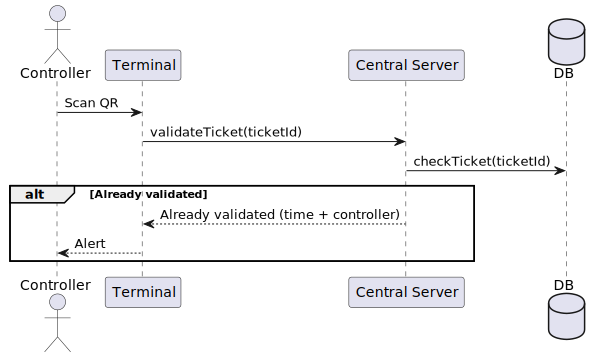

#### 7.6.1. Objectif du scénario

Ce scénario décrit le traitement d’un billet déjà validé lorsqu’il est présenté une seconde fois à un contrôleur. Il s’agit d’un cas particulier de contrôle en ligne, dans lequel le système ne cherche plus à confirmer la validité normale du billet, mais à détecter une réutilisation, un doublon de présentation ou un comportement potentiellement frauduleux.

L’objectif principal de ce scénario est de permettre au système de :

    - détecter qu’un billet a déjà été validé au niveau global ;
    - empêcher toute nouvelle validation de ce même billet ;
    - informer immédiatement le contrôleur de la situation ;
    - fournir des éléments contextuels utiles, tels que l’heure et l’identité du contrôleur ayant réalisé la première validation.

Ce scénario est essentiel pour garantir l’unicité de l’usage d’un billet et renforcer la sécurité du système Tou-Tou. Il constitue également une extension naturelle du scénario de validation en ligne, puisqu’il repose sur la même chaîne de traitement, mais dans une branche métier particulière.

#### 7.6.2. Acteurs et composants impliqués

Le scénario mobilise les composants suivants :

    - Controller : agent humain réalisant le contrôle ;
    - Terminal : terminal de lecture et d’affichage utilisé lors du contrôle ;
    - Central Server : serveur central chargé de vérifier l’état réel du billet ;
    - DB : base de données contenant l’historique des validations et l’état du billet.

Dans le diagramme de classes, les éléments principalement concernés sont :

    - ValidationController : point d’entrée API de la demande de validation ;
    - ValidationService : service portant la logique de détection du cas de double scan ;
    - ValidationRepository : composant de persistance des validations déjà enregistrées ;
    - TicketRepository : composant utilisé pour récupérer l’état du billet ;
    - Ticket : entité représentant le billet présenté ;
    - Validation : entité contenant les traces antérieures de validation ;
    - ValidationResult : enum représentant le résultat du contrôle.

Ce scénario est donc centré sur l’exploitation de l’historique de validation afin de prendre une décision immédiate et fiable.

#### 7.6.3. Préconditions

Les préconditions de ce scénario sont les suivantes :

    - un billet existe déjà dans le système ;
    - ce billet a déjà fait l’objet d’une validation enregistrée au niveau central ;
    - le terminal du contrôleur est connecté au serveur ;
    - la base de données est accessible ;
    - le QR code présenté permet de retrouver l’identifiant du billet.

Ces conditions permettent de déclencher la branche spécifique correspondant à un double scan.

#### 7.6.4. Données manipulées dans le scénario

Le scénario manipule des données proches de celles du scénario de validation en ligne, mais avec une attention particulière portée aux informations historiques.

**Données d’entrée :**

    - identifiant du billet extrait du QR code (ticketId) ;
    - identifiant du terminal ou du contrôleur courant.

**Données consultées :**

    - état actuel du billet ;
    - existence d’une validation antérieure ;
    - heure de la première validation ;
    - identité du contrôleur ou du terminal ayant effectué cette validation.

**Données produites :**

    - message d’alerte retourné au terminal ;
    - absence de nouvelle validation en base ;
    - information contextuelle permettant au contrôleur d’interpréter la situation.

Ces données correspondent principalement aux classes `Ticket` et `Validation`.

#### 7.6.5. Déroulement détaillé du scénario

##### a) Scan du billet

Le scénario débute lorsque le contrôleur scanne un QR code présenté par un voyageur. Le terminal lit le code puis transmet l’identifiant du billet au serveur central via l’appel : validateTicket(ticketId). Le terminal ne prend aucune décision locale. Comme dans le scénario de validation en ligne, il délègue entièrement la décision métier au serveur central.

##### b) Consultation de l’état du billet

Le serveur central interroge la base de données à l’aide de l’appel checkTicket(ticketId). Cette opération permet de retrouver l’état courant du billet ainsi que les validations déjà associées. Le serveur vérifie notamment :

    - si le billet existe ;
    - s’il a déjà été marqué comme validé ;
    - quelle validation a été enregistrée ;
    - à quel moment et par quel contrôleur cette validation a été faite.

Cette phase de lecture est cruciale, car elle permet d’identifier le cas précis d’un billet déjà utilisé.

##### c) Détection du cas "Already validated"

Le diagramme montre un bloc `alt` associé à la condition : [Already validated]. Lorsque cette condition est vraie, le serveur central ne procède à aucune nouvelle écriture en base. Il prépare simplement une réponse enrichie contenant le contexte de la validation déjà existante, par exemple : l'heure de validation, l'identifiant du contrôleur précédent.

Cette réponse est modélisée dans le diagramme par : Already validated (time + controller)

Le terminal reçoit alors cette information et l’exploite pour avertir le contrôleur.

##### d) Affichage d’une alerte

Une fois la réponse du serveur reçue, le terminal affiche une alerte au contrôleur :Alert. 
Cette alerte ne constitue pas seulement un rejet abstrait. Elle informe le contrôleur que le billet a déjà été utilisé et fournit, si nécessaire, des détails supplémentaires sur cette première validation.

L’intérêt de cette étape est double : d'empêcher une nouvelle validation et de permettre une interprétation plus fine de la situation sur le terrain.

Par exemple, le contrôleur peut distinguer un simple rescan involontaire d’une tentative manifeste de réutilisation d’un billet.

#### 7.6.6. Analyse des échanges de données

Le scénario ne comporte pas d’écriture en base, ce qui constitue une différence importante par rapport à une validation normale.

**Entre le terminal et le serveur :**

    - envoi du ticketId ;
    - réception d’un message enrichi indiquant que le billet a déjà été validé.

**Entre le serveur et la base de données :**

    - lecture de l’état du billet ;
    - lecture de la validation déjà enregistrée ;
    - absence de création d’une nouvelle validation.

Ce fonctionnement montre que le système respecte ici un principe d’idempotence métier : un billet déjà validé ne doit pas produire un nouvel effet lors d’une présentation ultérieure.

#### 7.6.7. Cohérence avec le diagramme de classes

Ce scénario s’inscrit de manière cohérente dans le modèle statique.

    - L’entité Ticket fournit l’identifiant et l’état du billet.
    - L’entité Validation contient les traces déjà enregistrées.
    - Le ValidationService prend la décision métier.
    - Le ValidationRepository ou le TicketRepository permettent de consulter l’état historique.
    - L’énumération ValidationResult permet d’exprimer un résultat de contrôle négatif ou anormal selon la logique retenue.

Le diagramme de classes fournit ainsi la structure nécessaire à la détection d’un double scan sans introduire de mécanisme supplémentaire ad hoc.

#### 7.6.8. Hypothèses de conception

Le scénario repose sur plusieurs hypothèses :

    - les validations antérieures sont stockées de manière fiable ;
    - le serveur central est la seule autorité capable de confirmer qu’un billet a déjà été utilisé ;
    - le terminal dispose d’une interface suffisamment explicite pour afficher une alerte claire ;
    - le contrôleur est capable d’interpréter correctement cette alerte dans son contexte opérationnel.

Ces hypothèses permettent de maintenir la simplicité du modèle tout en couvrant un cas métier sensible.

#### 7.6.9. Limites et points d’attention

Ce scénario met en lumière plusieurs points délicats :

    - un double scan peut résulter soit d’une fraude, soit d’une erreur de manipulation ;
    - l’information affichée au contrôleur doit être suffisamment claire pour éviter des interprétations ambiguës ;
    - la qualité de la détection dépend de la fraîcheur et de la cohérence des données centrales ;
    - un problème de latence ou de concurrence pourrait théoriquement compliquer l’identification du premier validateur.

Ces limites montrent que le double scan est un cas métier critique, car il se situe à la frontière entre usage normal, erreur humaine et comportement frauduleux.
### 7.7. Gestion de Connexion

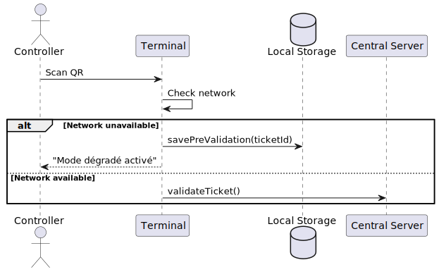

#### 7.7.1. Objectif du scénario

Ce scénario décrit le comportement du terminal de contrôle lorsqu’un billet est scanné dans un contexte où la disponibilité du réseau doit d’abord être déterminée avant de choisir le mode de traitement approprié. Il ne s’agit donc pas d’un scénario purement métier comme l’achat ou la validation, mais d’un scénario de gestion technique influençant directement l’exécution des autres scénarios de contrôle.

L’objectif principal est de permettre au terminal de :

    - détecter si la connexion avec le serveur central est disponible ;
    - orienter automatiquement le traitement vers la validation en ligne si le réseau est opérationnel ;
    - basculer en mode dégradé et enregistrer une pré-validation locale si le réseau est indisponible ;
    - informer immédiatement le contrôleur du mode de fonctionnement activé.

Ce scénario joue un rôle transversal dans l’architecture du système. Il constitue le point d’articulation entre la validation en ligne et la gestion hors ligne. En ce sens, il ne remplace pas les scénarios précédents, mais détermine lequel doit être appliqué à un instant donné.

#### 7.7.2. Acteurs et composants impliqués

Le scénario mobilise les éléments suivants :

    - Controller : acteur humain qui initie le contrôle du billet ;
    - Terminal : terminal chargé de lire le QR code, de tester la connectivité et d’orienter le traitement ;
    - Local Storage : composant local utilisé en cas de mode hors ligne ;
    - Central Server : serveur central utilisé lorsque le réseau est disponible.

Dans le diagramme de classes, ce scénario s’appuie principalement sur :

    - ValidationService : service logique lié à la validation du billet ;
    - LocalStorage : composant utilisé pour conserver les contrôles différés ;
    - Ticket et Validation : entités indirectement concernées selon la branche suivie ;
    - ValidationMode : enum distinguant les traitements en ligne et hors ligne.

#### 7.7.3. Préconditions

Les préconditions du scénario sont les suivantes :

    - un contrôleur dispose d’un terminal fonctionnel ;
    - un voyageur présente un billet sous forme de QR code ;
    - le terminal est capable de lire le QR code ;
    - le système doit pouvoir tenter ou simuler une vérification de disponibilité du réseau.

Contrairement aux scénarios précédents, ce scénario ne suppose pas à l’avance que le réseau est disponible ou non. C’est précisément cette indétermination initiale qui justifie son existence.

#### 7.7.4. Données manipulées dans le scénario

Les données échangées dans ce scénario sont relativement simples, mais elles déterminent l’orientation de tout le flux de traitement.

**Données d’entrée :**

    - QR code présenté par le voyageur ;
    - identifiant du billet (ticketId) extrait du QR ;
    - état courant de la connexion réseau.

**Données intermédiaires :**

    - résultat du test de connectivité ('network available' ou 'network unavailable') ;
    - choix du mode de validation correspondant.

**Données produites :**

    - pré-validation locale en cas d’absence de réseau ;
    - ou requête de validation en ligne en cas de réseau disponible ;
    - message affiché au contrôleur.

Ces données ne sont pas toutes persistées, mais elles conditionnent directement la branche de traitement qui sera suivie.

#### 7.7.5. Déroulement détaillé du scénario

##### a) Scan initial du billet

Le scénario débute lorsque le contrôleur scanne le billet présenté par le voyageur. Cette action est représentée par : Scan QR

Le terminal lit alors le contenu du QR code et extrait l’identifiant du billet. À ce stade, aucune validation n’est encore réalisée. Le terminal se trouve dans une phase de préparation du traitement.

##### b) Vérification de la disponibilité du réseau

Avant de décider comment traiter la validation, le terminal exécute une opération interne : Check network. Cette étape consiste à tester si le terminal peut joindre le serveur central dans des conditions suffisamment fiables pour réaliser une validation en ligne.

Le résultat de cette vérification oriente ensuite le scénario dans l’une des deux branches du bloc `alt`.

##### c) Cas alternatif : réseau indisponible

Si la condition : [Network unavailable] est satisfaite, le terminal ne tente pas d’envoyer immédiatement la requête de validation au serveur. Il bascule en mode dégradé et appelle : savePreValidation(ticketId).

Cette opération enregistre localement une trace du contrôle dans `Local Storage`. Il ne s’agit pas d’une validation officielle, mais d’une pré-validation destinée à être synchronisée plus tard.

Le terminal affiche alors le message : "Mode dégradé activé"

Ce message informe explicitement le contrôleur que le billet n’a pas été validé au niveau central, mais qu’un traitement local temporaire a été mis en place.

Cette branche du scénario correspond à une politique de résilience : le contrôle peut continuer, mais avec un niveau de garantie limité.

##### d) Cas alternatif : réseau disponible

Si la condition: [Network available] est satisfaite, le terminal choisit au contraire de transmettre directement la demande au serveur central via :
validateTicket()

Cette branche renvoie alors implicitement vers le scénario 7.2 de validation en ligne. Le terminal ne conserve pas d’état local particulier, car la décision de validation est traitée immédiatement par le backend.

Ce second cas représente le fonctionnement nominal du système lorsque la connectivité est suffisante.

#### 7.7.6. Analyse des échanges de données

Le scénario met en évidence un mécanisme de routage logique entre deux modes d’exécution.

**Entre le terminal et son environnement local :**

    - lecture du QR code ;
    - test de connectivité ;
    - éventuel enregistrement dans le stockage local.

**Entre le terminal et le serveur central :**

    - envoi d’une requête de validation en cas de réseau disponible.

Ce scénario est intéressant car il ne porte pas directement sur une règle métier liée au billet lui-même, mais sur une condition technique préalable qui influence la suite du traitement. Il introduit donc une logique d’adaptation du système à son environnement d’exécution.

#### 7.7.7. Cohérence avec le diagramme de classes

Ce scénario est cohérent avec le diagramme de classes dans la mesure où il mobilise deux composants déjà identifiés :

    - ValidationService, pour le traitement de la validation en ligne ;
    - LocalStorage**, pour le stockage local des pré-validations.

Le diagramme de classes ne modélise pas explicitement une classe dédiée au test réseau, mais ce comportement peut être compris comme une logique interne du terminal ou du service de validation. Dans le cadre du projet, cela reste cohérent avec un niveau de modélisation D2.

L’important est que la distinction entre validation centralisée et pré-validation locale soit bien représentée, ce qui est le cas ici.

#### 7.7.8. Hypothèses de conception

Le scénario repose sur plusieurs hypothèses :

    - le terminal peut évaluer l’état de la connectivité réseau de manière suffisamment fiable ;
    - le passage entre mode connecté et mode dégradé est automatique ;
    - le stockage local est disponible lorsqu’il faut enregistrer une pré-validation ;
    - le contrôleur accepte d’adapter son comportement selon le message affiché par le terminal.

Ces hypothèses permettent de maintenir la cohérence du système sans introduire de complexité excessive dans la modélisation.

#### 7.7.9. Limites et points d’attention

Plusieurs limites doivent néanmoins être signalées :

    - la qualité du test réseau peut varier selon le contexte technique ;
    - un réseau instable peut provoquer des changements fréquents de mode ;
    - un billet traité en mode hors ligne peut finalement être rejeté lors de la synchronisation ;
    - l’ergonomie du message affiché au contrôleur est essentielle pour éviter les erreurs d’interprétation.

Ce scénario rappelle donc que certaines décisions critiques dépendent non seulement de la logique métier, mais aussi de l’environnement technique du système.

## 8. Diagrammes d'Objet pour données critiques
### 8.1. Diagramme d'Objet Gestion de Validation 
Ce diagramme d’objet illustre un exemple concret de situation de validation d’un billet dans le système. Il met en relation un utilisateur, un contrôleur et un billet déjà validé. L’objectif de cette représentation est de montrer, à travers des instances précises, comment un billet peut être associé à un utilisateur tout en étant pris en charge dans un contexte de contrôle. Le statut VALIDATED indique ici que le billet a déjà été reconnu comme valide par le système, ce qui permet d’illustrer l’état d’un billet après une opération de validation réussie.

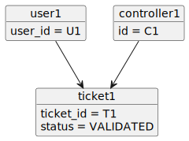
### 8.2. Diagramme d'Objet Pré-validation
Ce diagramme représente une situation de pré-validation dans un contexte hors ligne. Le terminal fonctionne ici en mode OFFLINE et manipule un billet avant toute validation définitive par le serveur central. Cette représentation permet d’illustrer le comportement local du système lorsqu’une connexion réseau n’est pas disponible. Elle met en évidence le fait qu’un terminal peut conserver temporairement des informations sur un billet afin de poursuivre le contrôle dans un mode dégradé, avant une éventuelle synchronisation ultérieure avec le backend.

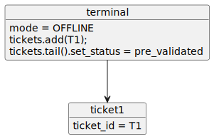
### 8.3 Diagramme d'Objet Double Vérification
Ce diagramme d’objet montre un cas de double vérification d’un même billet. Le billet ticket1 apparaît ici comme déjà validé, avec une référence explicite au premier contrôleur ayant effectué la validation. Deux validations distinctes sont cependant représentées, ce qui permet d’illustrer une situation potentiellement conflictuelle dans laquelle plusieurs opérations de contrôle concernent le même billet. Cette représentation est utile pour matérialiser les cas où le système doit détecter une seconde tentative de validation et préserver la cohérence de l’état global du billet.

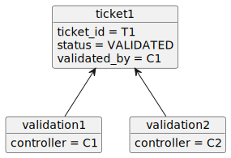
